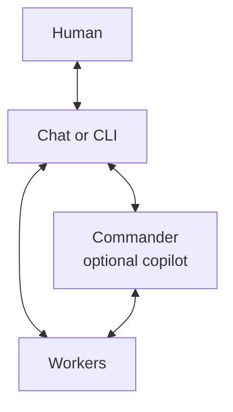

# Digitaltwin

Digitaltwin is a self-hosted AI team for people who want durable, reviewable work rather than a one-off chat answer. It gives an owner one place to talk to a team, start bounded coding or research workflows, keep the resulting decisions and artifacts in Git, and retain a clear human approval point.

## Why it exists

Long-running AI work is difficult to trust when the request, session, code, review, and follow-up live in different places. Digitaltwin gives the person responsible for that work one team they can guide and inspect without treating an agent conversation as authority by itself:

- A chat interface lets people and bots keep questions, direction, and results together; a CLI provides a second direct way to control workers.
- A control service keeps the human, request, current work, and result connected so only authorized work moves forward.
- Private worker environments give agents a durable place to complete bounded tasks without exposing their sessions.
- Git keeps the specification, plan, changes, review evidence, and approvals available for inspection.

The outcome is a small remote team that can preserve context across restarts and make its work inspectable, while still stopping for the human decisions that matter.



People can work directly with workers through chat or a CLI. They can also ask Commander to coordinate a fleet; Commander is an optional copilot, not a required gateway. Each connection is two-way, so questions, direction, status, and results can travel both ways. This diagram shows the product flow, not implementation technology.

## Commander

Commander is an optional copilot for coordinating a fleet, sharing status, and helping people steer work. People can also work directly with workers through chat or a CLI.

## What is available today

The reviewed local core can build and start PostgreSQL, a plugin-free Mattermost image, Kirei web/worker processes, and the Runtime. It has durable jobs, migrations, health checks, private socket ownership, checksum-pinned Runtime clients, synthetic callback coverage, and restart/durable-job checks.

It is **not yet an enabled autonomous fleet**. Dispatch remains hard-blocked until authenticated chat/thread behavior, actual CLI lifecycle and settled-state evidence, and a selected Commander MCP round trip are captured. Signed mobile push/deep links, production infrastructure, provider credentials, and deployment operations also need their own operator evidence and authorization.

## Components

| Component | Responsibility |
| --- | --- |
| [integration-backend/](integration-backend/README.md) | Kirei control plane: verified chat intake, durable workflow state, Commander coordination, review gates, callbacks, and outbox delivery. |
| [agent-runtime/](agent-runtime/README.md) | Non-root Herdr and the supported CLIs, with persistent home/workspaces and the backend-owned callback/MCP clients. |
| [chat-backend/](chat-backend/README.md) | Pinned, minimally derived Mattermost Team Edition artifact and local chat configuration. |
| [push-service/](push-service/README.md) | The existing Mattermost push-proxy artifact and its non-secret compatibility/configuration contract. |
| [mobile-apps/](mobile-apps/README.md) | Reproducible recipes for our unsigned Mattermost-based iOS/Android builds. |
| [scripts/](scripts/README.md) and [tests/](tests/README.md) | Local Compose setup plus cross-service checks and evidence. |

## Run the credential-free local core with Docker

Docker Desktop (or a compatible Docker daemon) must be running. The sample values in `.env.example` are public local-development passwords, never production secrets.

```sh
docker compose --env-file .env.example config --quiet
scripts/acceptance config
scripts/acceptance dependencies
docker compose --env-file .env.example build mattermost
scripts/dev
```

`scripts/dev` preserves an existing ignored `.env`; otherwise it copies the public sample, stages the checksum-verified callback client, and runs `docker compose up --build -d --wait`. The default core starts PostgreSQL, Mattermost, backend web/worker, and Runtime after migrations and volume initialization.

For the equivalent manual flow, run `cp .env.example .env`, `scripts/prepare-callback-context`, then `docker compose up --build -d --wait`. Visit the local Mattermost port in `compose.yml` and use backend `/livez` or `/readyz` only as process health signals—not as evidence that provider/chat dispatch works.

Stop the local stack with `docker compose down`; volumes are retained for the next boot. Use `docker compose down --volumes` only for deliberately disposable data. Changing `.env` does not rotate roles in an existing PostgreSQL volume.

The `chat-validation` listener and `push` profiles are opt-in. They require separately supplied authenticated identities, mappings, and credentials; do not enable them merely to make a health check green. Production deployment, networking, TLS, backups, and secrets belong to the infrastructure repository or hosting platform, not this Compose file.

## Learn more

- [Repository layout and parallel build](docs/repository-layout-and-parallel-build.md)
- [Shared service boundaries and validation gates](docs/interfaces/service-boundaries.md)
- [Local integration wiring and evidence](docs/interfaces/local-integration.md)
- [Foundation validation checkpoint](docs/interfaces/foundation-validation.md)
- [Phase 0 fleet specification](docs/agent-fleet-architecture-and-review.md)
- [Commander routing setup and acceptance](docs/interfaces/commander-routing-setup.md)
- [Phase 1 group calls and AI voice](docs/phase-1-voice-commander.md)
