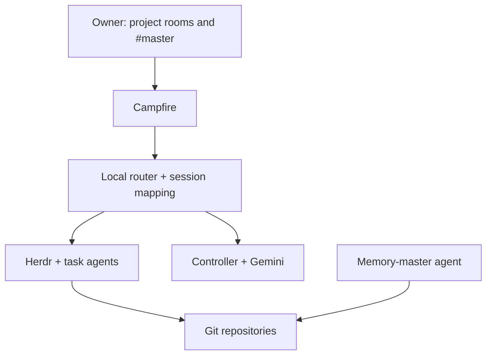

# Phase 0 — Agent fleet architecture and review decisions

This is the Phase 0 specification for a self-hosted fleet that can interview its owner, carry out coding and research tasks, preserve useful knowledge, and collaborate with another independently operated fleet. [Phase 1 adds a voice interface to the controller](phase-1-voice-controller.md).

## Goals and accepted boundaries

- Instruct agents from a mobile project room or a desktop terminal. Agents use repository instructions, skills, and runbooks to interview the owner as needed, then produce reviewable work.
- Code and research outcomes are committed to Git. Project agents write useful knowledge to the memory repository; a memory-master agent curates it.
- A Gemini-backed controller in `#master` can show progress across enrolled projects and direct authorized tasks. The controller model and task-agent model/provider can be replaced independently.
- Each deployment is one permission boundary. A second owner runs an independent stack. For a shared project, the two fleets may coordinate in a shared room and Git repository after their owners initiate collaboration.
- Campfire, Herdr, the router/controller, Headscale, and the other server-side infrastructure are open source and self-hosted. Codex CLI, Claude Code, and other agent/model providers are expressly allowed regardless of their licensing. Use the open-source Tailscale client components with self-hosted Headscale.
- GitHub Free is the approved Git host for now. Use ordinary Git remotes and a forge adapter so a self-hosted Git service can replace GitHub later. The choice of Git host is not a Phase 0 blocker. Git backs specs, plans, code, research, memory, and durable decisions; live routing and delivery cursors may use a local database.

## Machine baseline: Wagglebot

The Digitaltwin server uses [Wagglebot](https://github.com/swiknaba/wagglebot) as its Linux machine and project provisioning baseline. Pin its version, connect the server's dedicated agent OS user to the chosen Wagglebot configuration repository, and run its update flow for that user. Initialize and update each project repository with Wagglebot. It supplies the supported harnesses' global and project instructions, curated skills and agents, hooks, and compatible MCP configuration. Its local credential file stays with that OS user and outside Git. Separate permission-boundary deployments use separate OS homes, credentials, configuration, and runtimes.

Wagglebot's own phase numbers describe its product roadmap, not Digitaltwin's. Its current Phase 1 provisions environments and does not run agents; Digitaltwin owns the unattended agent runtime, Campfire routing, controller, task state, and cross-owner collaboration in this Phase 0. Do not make Digitaltwin depend on Wagglebot's planned shared memory or collaboration services merely because they address related needs.

## Components and authority

| Component | Responsibility |
| --- | --- |
| Wagglebot | Provisions the server user's harness configuration and project instruction, memory, and changelog files. |
| Campfire PWA and bot API | Human and agent conversation, explicit mentions, status messages, and links to artifacts. |
| Router | Authenticates and routes messages to the correct task and agent; persists delivery IDs and session mappings. |
| Herdr | Local workspace, pane, agent lifecycle, status, and SSH attachment. It is an execution surface, not the global task authority. |
| Superpowers artifacts | Existing specs, plans, execution ledgers, Git commits, and project deliverables define and track work. |
| Controller | Aggregates enrolled stack status and offers typed task/status operations in `#master`. Gemini is its first reasoning interface. |
| Memory-master | Periodically organizes and checks the memory repository; exposes relevant knowledge to future tasks. |
| Git forge | Stores code, research Markdown, memory, branches, reviews, and immutable revisions. GitHub now; replaceable later. |

Each stack owns its workspaces, Herdr socket, service account, bot identity, and repository credentials. The controller enrolls stacks with scoped status and command access. It does not gain their filesystem or Herdr socket access. A stack reports task state, agent state, last activity, branch/commit/PR, blocker, and verification evidence; stale/unreachable status is labeled as such.

## Task lifecycle using Superpowers artifacts

No new issue tracker or `tasks/<task-id>.md` is required. For architectural coding work, use the existing Superpowers flow: an approved design in `docs/superpowers/specs/`, an implementation plan in `docs/superpowers/plans/`, its checkable steps and execution ledger, then Git commits and review. Small bounded work can use the project's existing runbook and commits without a plan file. Research work produces a Markdown result, with a spec/plan only when its complexity warrants one. The existing `CHANGELOG.md` remains the human-readable summary of completed changes. Wagglebot also creates `.agents/changelog.md` for meaningful changes during agent sessions; the project runbook defines how these two existing logs relate, without using either as a task queue.

The router still needs a **small operational mapping**, not a new planning system: Campfire room/message or thread ID, project, active spec/plan or research artifact path, Herdr session, branch, assigned agent, approval revision, current status, and last activity. Store message delivery IDs and retry state locally. This allows concurrent tasks to resume and routes replies to the right session. Reconstruct status from Git artifacts, the existing Superpowers execution ledger when present, and Herdr after restarts. Superpowers' plan-scoped ledger is git-ignored scratch for execution resume; the Git commits and final artifacts are the durable cross-machine record.

A practical status view is `interview → plan/review → approved → working → verification → done`, with `blocked` and `cancelled` available when needed. This status is an index over existing work, not a second task document. A project room identifies a repository, never whichever pane happens to be active. New tasks and agent handoffs use explicit bot mentions because Campfire's bot webhook fires on mention or ping. The router checks the sender, ignores its own messages, deduplicates deliveries, and routes replies to the matching session.

[Superpowers brainstorming](https://github.com/obra/superpowers/blob/main/skills/brainstorming/SKILL.md) · [writing plans](https://github.com/obra/superpowers/blob/main/skills/writing-plans/SKILL.md) · [plan execution](https://github.com/obra/superpowers/blob/main/skills/executing-plans/SKILL.md)

## Interview, execution, and completion

Wagglebot-provisioned base prompts, skills, project instructions (including `AGENTS.md`), and the project runbook define how an agent interviews the owner, plans work, tests it, and reports results. Keep those as the behavioral rules; the control plane records the resulting states and artifacts. Superpowers' bounded-work path may skip a formal plan; architectural work follows the approved spec and plan.

An approval names the task, action, and exact spec/plan commit. Completion requires the runbook's evidence, not merely an idle agent pane. For code this may be tests, a diff, and a PR; for research it may be a Markdown report with source links, access dates, and stated uncertainty. The agent posts a concise result and artifact links to its task conversation. Merge, deployment, or other external effects follow the project's authorization rules.

Agents need project-scoped tools for their assigned work: shell and repository access for coding; search, page/PDF retrieval, and citation capture for research. A tool or model provider can change without changing the Superpowers artifacts and handoff protocol.

## Controller in `#master`

The controller uses typed operations such as `list_projects`, `list_tasks`, `get_task`, `request_status_update`, and `create_task`. It retrieves relevant task history on demand instead of loading every transcript into Gemini's context. Owner-authorized requests may assign a task to a project router; actions outside that project's scope return for a human decision. It reports blocked, completed, and stale work with links and timestamps, and can proactively notify the owner when an agent needs input or a requested deliverable is ready.

Herdr provides local agent state and controls; it does not supply the cross-stack project registry. The controller's status and authorization logic stays deterministic and model-independent.

## Memory capture and grooming

Wagglebot's committed `.agents/memory.md` holds durable facts local to each project. The separate memory repository holds knowledge meant to survive or inform work across projects; a project runbook tells agents when and what to write there. The memory-master grooms that shared repository, while project agents maintain their own local memory files. The completion report or existing changelog links the memory commit or says that no durable memory was needed. The router verifies that required memory updates were committed and pushed before reporting completion.

The memory-master runs periodically and may also receive task-completion events. It reviews new notes, merges duplicates, improves titles and links, moves material into appropriate folders, records provenance, and maintains a lightweight index for retrieval. It writes changes on a branch and follows the memory repository's review rules for substantial reorganization. It must preserve source material and avoid inventing facts while summarizing. Project agents retrieve relevant notes on demand; they do not load the whole vault into every prompt.

## Collaboration between independent stacks

For an agreed shared project, use one Campfire instance with a shared project room. Each owner and each fleet's bot joins that room; both routers remain local to their own stacks. The owners initiate and scope the collaboration. After that, agents may address one another with explicit `@mentions`, agree on subtasks in chat, and continue exchanging work without a human relaying each turn.

Each handoff names the shared task, intended recipient, requested action, and Git branch/commit or PR. The recipient verifies the sender and repository, fetches the referenced revision with its own credentials, and answers in the same task conversation. Chat carries coordination; Git carries documents and code. The routers deduplicate handoffs, track pending replies, retry or surface failures, and avoid bot loops. Agents ask the owners when work exceeds the agreed scope or they cannot resolve a disagreement. Neither fleet has access to the other's private projects, Herdr socket, or filesystem.

## Operations and acceptance

Run services under distinct identities, keep secrets out of Git, restrict Herdr sockets locally, and use Headscale for private server access. Define how the iPhone reaches Campfire and how missed messages are recovered. Limit concurrent tasks per stack, allow pause/cancel, and surface crashes and prolonged blockers to the owner. Back up the local router/controller state; Git remains the recoverable source for specs, plans, code, research, memory, and decisions.

Phase 0 is acceptable when the owner can start two concurrent tasks, answer an interview from mobile, approve a specific revision, receive verified code and research Markdown, find a committed memory update, and get accurate status in `#master` after a disconnect/restart. In a second test, two independent stacks complete a shared task through Campfire and Git without exposing their private workspaces.

## Review decisions

The initial review's routing, approval, recovery, and cross-stack findings are incorporated above. The agreed simplifications are: Wagglebot as the server user's harness and project provisioning baseline; existing Superpowers specs/plans and the changelog instead of an issue tracker or new task files; existing prompts/skills/runbooks for behavior; natural agent-to-agent coordination over Campfire with explicit Git handoffs; a periodic memory-master; GitHub Free as the current swappable host; and the approved agent CLIs plus Headscale networking.
