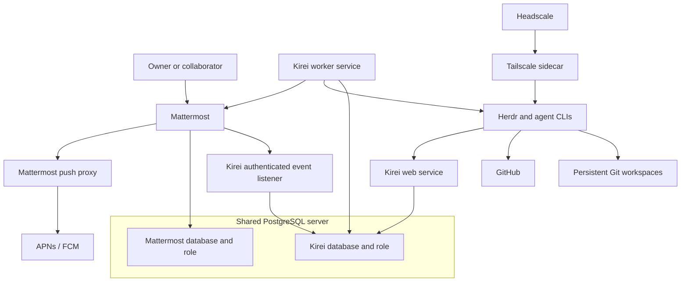

# Phase 0 — Agent fleet specification

This document records the accepted Phase 0 decisions from the design interview.
It also lists the remaining decisions that the implementation plan must resolve.
[Phase 1 adds a voice interface to the Commander](phase-1-voice-commander.md).

## 1. Outcome

Phase 0 provides a self-hosted agent fleet on one Linux server.
The owner controls project work through Mattermost or an attached Herdr terminal.

Each project workflow uses a writer and a reviewer from different model families.
The system preserves specifications, plans, reviews, code, and research in Git.

The deployment includes a persistent **Commander** for operational conversation, status, coordination, and targeted emergency changes. Its Mattermost display name is **Commander Shepard**.
Commander uses the same local agent runtime as project work; the target durable session role is `commander`.
The [naming audit](interfaces/commander-naming-upgrade.md) records the required migration from existing storage.

Separate deployments communicate only through Mattermost and Git.
They do not share filesystems, databases, sockets, private networks, or Commander APIs.

## 2. Phase boundary

Phase 0 validates one target environment and one deployment boundary.
All project agents share this boundary for the minimum viable product.

Phase 0 includes:

- Dockerized application services for one deployment.
- Mattermost Team Edition for human and agent chat.
- Our mobile builds and self-hosted Mattermost push proxy/APNs/FCM.
- Herdr for agent lifecycle management.
- Codex CLI, Claude Code, OpenCode, and Gemini CLI.
- Wagglebot for agent and project configuration.
- A Kirei control plane.
- PostgreSQL for control state and durable jobs.
- GitHub as the initial Git forge.
- A configurable memory repository.
- Headscale and Tailscale for private Herdr access.
- Encrypted off-site backups.

Phase 0 excludes:

- Multi-server scheduling and cross-server orchestration.
- A second security boundary for individual projects or agents.
- A built-in issue tracker.
- Automatic pull request merge behavior.
- Automatic post-merge synchronization.
- Group calls and AI voice; Phase 1 owns the LiveKit integration.
- Scheduled memory grooming.
- Provider login through Mattermost.
- Direct control APIs between independent deployments.

## 3. Hosting assumptions

The initial operator environment uses Ubuntu 24.04 LTS on AMD64.
The same application images can run on a compatible hosted container service.
This host choice does not determine the container base images.

Digitaltwin does not enforce a minimum server size.
The operator measures resource use and changes hosting capacity when necessary.

The operator supplies these external facilities:

- DNS records.
- TLS certificates through the existing reverse proxy.
- Secure public endpoint routing.
- The existing SSH bastion for raw server administration.

Each application image contains its direct application dependencies.

## 4. Container delivery model

The application repository owns its Dockerfiles and deployable container images.
It also documents environment, secret, volume, port, and health-check contracts.
The repository includes a Docker Compose file for local development and integration tests.
That file can start the required local dependencies with the application images.

The application repository pins runtime tools and packages to exact versions in checked-in manifests.
The Kirei application pins Ruby 4.0.7.
The infrastructure layer selects production application images by explicit supported release tag; a major/minor tag is sufficient when the upstream publishes one.
The operator upgrades those versions through reviewed manifest changes and rebuilt images.

The infrastructure repository or hosting platform owns production orchestration.
This includes production Compose files, networks, volumes, routing, restart policies, and backup schedules.

Digitaltwin uses the official, unmodified Mattermost Team Edition server artifact, selected by explicit release version.
Kirei integrates externally through bot accounts, REST APIs, and authenticated WebSocket events.
Mattermost supplies channels, real threads, PostgreSQL storage, and the browser interface.
Keep server migrations, storage, configuration, and upgrades separate from Kirei.
No chat server fork or database port is required.

The [official compiled license](https://github.com/mattermost/mattermost/blob/master/server/build/MIT-COMPILED-LICENSE.md) is MIT and explicitly excludes source code.
[Server source licensing](https://github.com/mattermost/mattermost/blob/master/LICENSE.txt) includes AGPL and commercial components; webapp licensing is Apache 2.0.
A custom server build does not automatically inherit the official compiled-artifact license.
Prefer the official Team Edition artifact; any later server modification requires a separate source/dependency license review.
Exclude commercially licensed components from selected plugins and custom builds; replace needed functions independently.
Do not remove license checks or reuse paid modules to unlock capabilities.
Audit exact artifacts, bundled plugins, transitive dependencies, notices, and trademark obligations before release.
An incompatible component blocks that release until omitted or independently replaced.

Use our own [Apache 2.0 mobile app builds](https://github.com/mattermost/mattermost-mobile/blob/main/LICENSE.txt).
The [desktop client](https://github.com/mattermost/desktop/blob/master/LICENSE.txt) is also Apache 2.0; custom desktop builds are optional.
Mobile delivery requires our own application IDs, signing, distribution, security updates, and upstream maintenance.
Use the existing [Mattermost push proxy](https://github.com/mattermost/mattermost-push-proxy) with APNs/FCM for self-hosted push.
Keep it separate from Kirei; custom mobile builds must use matching push configuration and credentials.
Human setup of Apple/Google enrollment, signing keys, push credentials, and distribution remains future work.
Self-hosting still incurs hosting, distribution, and model costs.

Mattermost Calls/rtcd are excluded from the chosen deployment; Phase 1 uses independently integrated LiveKit.
The [Agents plugin](https://github.com/mattermost/mattermost-plugin-agents) is not a required dependency.
Mattermost remains chat transport/UI; MCP integration is not required in a chat plugin.
Its [commercial capability gates](https://github.com/mattermost/mattermost-plugin-agents/blob/master/enterprise/license.go) restrict multi-provider, external MCP, and state-changing tools.
Its repository includes commercially licensed code despite its Apache label.
Kirei's external Commander/Worker bots provide the selected path without promising free plugin MCP capabilities.
The [LiteLLM/MCP direction](https://github.com/swiknaba/digitaltwin/issues/4) belongs after Phase 2; it adds no Phase 0/1/2 requirements.
Keep current agent/Commander tool interfaces until that later design.
Audit optional plugins individually. Hermes remains a candidate, not an adopted dependency.

The application provides portable OCI images and environment configuration.
The images can run through Docker Compose, AWS ECS, or another compatible platform.

Phase 0 builds Kirei and agent Runtime images and integrates pinned upstream Team Edition and push-proxy artifacts.
It also delivers our own signed mobile builds and their maintenance pipeline; it does not rebuild the chat server.
PostgreSQL, Headscale, Tailscale networking, and S3 remain external integration services.
Prefer Alpine for the Kirei image when its pinned dependencies pass runtime checks.
Select the agent runtime base after validating Herdr and all required CLIs.
Use Ubuntu for an image only when a verified dependency or runtime need requires it.

The Kirei control plane is a modular monolith.
One application image runs as separate web, worker, and authenticated event-listener services.

An operator-supplied PostgreSQL service stores control state and durable jobs.
Kirei implements a jobs table and worker loop with short [`FOR UPDATE SKIP LOCKED`](https://www.postgresql.org/docs/current/sql-select.html) claims.
Workers use bounded retries, idempotency keys, leases, and expired-lease recovery.
Notifications can wake a worker, but job rows remain the durable source of truth.
The worker dispatches Herdr work, reconciles uncertain effects, and sends outbox messages outside chat event ingestion.
It does not wait for an entire interactive agent session before accepting the next job.
Kirei requires neither Sidekiq nor Redis.
An external effect with an unknown result stays blocked for reconciliation unless its idempotency is proven.

Mattermost uses the same PostgreSQL server, with a separate database and role.
Each application owns its migrations and cannot read or modify the other's tables.
Mattermost attachments and configuration use their own persistent storage.
No Redis/Resque, Rails, SQLite port, or custom chat-thread schema is carried over from the superseded chat design.
Infrastructure owns Team Edition and push-proxy health checks, persistent storage, restart policies, TLS, and production lifecycle.

## 5. Service architecture

The Kirei application owns these modules:

- Mattermost authenticated event ingestion, REST reconciliation, and message delivery.
- Project enrollment and channel mapping.
- Workflow state and approval gates.
- Agent session commands through Herdr.
- Review phase coordination.
- Commander tools.
- Git and GitHub operations.
- Audit events and operational status.
- Durable job execution and retry behavior.

Herdr remains the provider abstraction and execution surface.
The control plane does not implement a task adapter for each agent CLI.
The worker uses [Herdr's Unix socket API](https://herdr.dev/docs/socket-api/) through a task-local shared volume.
The application pins the Herdr server and API schema to one compatible version.
Production orchestration places the Kirei worker and agent runtime on the same host or task.

## 6. Runtime boundary and persistence

Herdr and all agent CLIs run in one non-root runtime container.
All projects and agents share this accepted Phase 0 trust boundary.

The runtime container has these restrictions:

- No Docker socket.
- No privileged mode.
- No host root mount.
- Dropped Linux capabilities unless a measured requirement proves necessary.
- A non-root runtime user.
- Only required persistent volumes and network access.

The runtime declares persistent volumes for these items:

- Repository workspaces.
- The runtime user home.
- Herdr configuration and session metadata.
- Agent CLI login state.
- Wagglebot configuration.

Repository workspaces use `/workspace/repos` as the default root.
A repository slug determines its path under that root.
Each workflow uses a separate Git worktree under `/workspace/worktrees/<workflow-uuid>`.
Its writer and reviewer share that worktree and workflow branch.
Worktrees provide checkout separation within the shared runtime trust boundary.
They do not provide a separate security boundary.

PostgreSQL maps each workflow role to its current Herdr pane and live agent alias.
Herdr aliases are runtime identifiers, not durable workflow identifiers.
After a restart, the worker reconciles those mappings with Herdr and Git state.
It treats Herdr's `unknown` state as uncertain, not as completion.

### Worker execution tools

Install the tool baseline in the Herdr Runtime image used by both Writer and Reviewer.
Installing tools only in Kirei, the host, or the operator's workstation does not satisfy this requirement.
Both roles receive the same executable PATH and tool versions through their actual CLI shell execution environment.
Reuse existing Ruby, Node/npm, Git, OpenSSH, and Wagglebot provisioning; do not create another agent setup layer.

The baseline provides Bash, GNU coreutils/findutils/grep/sed/diffutils/patch/tar, portable awk, ripgrep, fd, and jq.
It also provides Git, curl, CA certificates, file, gzip, zip/unzip, and Python 3.
Use Python's standard library for short temporary scripts, including JSON, CSV, pathlib, regular expressions, hashing, and subprocesses.
Project-specific compilers, database clients, browsers, linters, and third-party Python dependencies remain explicit project requirements.
Do not install them globally as an incidental agent action.

Image builds install distribution packages and record resolved versions against the pinned base image.
Verify GNU commands on PATH where required; Alpine's BusyBox implementations do not imply GNU options or behavior.
Keep `/bin/sh` portable and use Bash explicitly for Bash scripts.
The implementation plan specifies package names, command variants, and functional smoke checks.
Offline checks run as the Runtime user with each role's shell configuration.
The existing operator checklist verifies actual Writer and Reviewer CLI tool execution with their configured provider sessions.

Temporary scripts use a unique directory from `mktemp -d` or Python `tempfile` in the Runtime's writable temporary storage.
Clean up that directory on completion or failure; never remove another session's temporary files.
Keep disposable files outside the tracked worktree and disable Python bytecode creation for temporary analysis.
Reviewer analysis must preserve the reviewed worktree; only its designated review Markdown may change.
Temporary files are not recovery state. Preserve durable results through the existing workflow artifacts and callbacks.

## 7. Supported agents

Phase 0 installs and pins these agent CLIs:

- Codex CLI.
- Claude Code.
- OpenCode.
- Gemini CLI.

The runtime image installs supported Herdr integrations for Codex, Claude Code, and OpenCode.
Gemini CLI uses Herdr's screen-state detection until Herdr supplies a native integration.
The local integration test verifies that each CLI starts through Herdr.

The operator signs in to each provider through an interactive terminal session.
The runtime persists the resulting login state.
Mattermost does not implement a provider authentication flow.

Gemini CLI can run and monitor its assigned session through Herdr after integration validation.
When configured as Commander, it can request other sessions through the authorized creation path in §17.
Herdr does not guarantee native Gemini session restore.
The workflow restores context from committed artifacts when it starts a fresh Gemini session.

## 8. Writer and reviewer policy

Each workflow selects one writer configuration and one reviewer configuration.
Each configuration identifies a provider and model.

The writer and reviewer must use different underlying model providers and base model families.
Different CLI brands do not qualify when they use the same underlying model family.
The default configuration uses Codex as writer and Claude Code as reviewer.

The workflow records the CLI, model provider, model identifier, and model family for both roles.
It rejects a writer and reviewer pair that does not meet the diversity rule.

The owner can override both configurations for each workflow.
This supports changes based on cost, available usage, or task fit.

A worker session means the LLM conversation and its context, not the runtime container, process, or Herdr pane alone.
Reuse a healthy conversation only for the same workflow topic, role, and agent configuration.
Writer and reviewer retain separate conversations.
Unrelated work and every new workflow start with fresh conversations, even in the same repository.
When a conversation cannot be reused reliably, create a fresh session from that workflow's saved state and committed artifacts.
Restore its specification, plan, reviews, phase, revisions, and approvals; do not import another task's conversation.
Commander deliberately shares fleet context under §17; independent fleets never share private session context.
Conversation separation does not create a security boundary within the shared runtime.

The writer and reviewer are workflow phases behind one project bot identity.
They are not separate Mattermost accounts.

## 9. Wagglebot integration

Wagglebot provides the runtime user's global agent configuration.
It also provides project instructions, skills, agents, hooks, and compatible MCP configuration.

The runtime installs Wagglebot with its supported Node.js version.
The current Wagglebot baseline requires Node.js 22.20 or later, npm, and Git.

Initial server setup uses this supported sequence:

1. Install the pinned Wagglebot package.
2. Run `wagglebot connect <company-git-url>` as the runtime user.
3. Run `wagglebot update --wagglebot` as the runtime user.
4. Run `wagglebot init` for each enrolled project.
5. Run `wagglebot update` for each enrolled project.

Wagglebot uses the same persistent runtime home as the agent CLIs.
Its credentials remain outside Git.
The runtime image pins the Wagglebot version.
It updates Wagglebot only after an explicit operator command.

## 10. Mattermost channel model

One Mattermost channel represents one repository; PostgreSQL stores the explicit `channel_id` to `owner/repository` mapping.
Mattermost channel URL names cannot contain `/`; do not treat a channel name as a trusted repository slug.
Use a valid channel name and display the repository slug where supported.
Enrollment accepts an explicit slug and records the verified remote identity.
A rename cannot change the mapping.

One Mattermost thread represents one project workflow.
Its identity is the root post ID: use a reply's `root_id`, or the root post's own `id`.
Verify the post, root, sender, channel, team context, and current membership through the authenticated server API.
One channel can have several active workflows; different channels can run concurrently.
The application imposes no fleet-wide concurrency limit and hides internal workflow identifiers in ordinary chat.

Use authenticated WebSocket events for ordinary replies, including replies without repeated mentions.
A supervised listener stores verified events in Kirei's durable inbox before dispatch.
Reconnect with REST history reconciliation and persisted checkpoints; WebSocket connection sequence numbers are not durable delivery IDs.
Deduplicate post/event revisions and overlap backfill to recover disconnects without duplicate effects.
The contract spike validates authentication, visibility, membership changes, edits/deletions, reply placement, and restart recovery.
Outgoing webhooks alone are not assumed to deliver every threaded reply.
Mattermost owns access and native threads; Kirei owns workflow mapping and gates.
Mobile thread navigation and reply placement must pass on our own builds.

## 11. Mattermost bot identities

The deployment uses two Mattermost bot accounts:

- `@agent` is Commander (display name: Commander Shepard).
- `@worker` handles project workflow phases.

The exact account handles remain configurable for each deployment.
The default handles are `agent` and `worker` when those names are available.
An operator selects unique handles when multiple fleets use one Mattermost instance.

Kirei holds the Mattermost credentials and posts under the configured Agent or Worker bot identity.
Writer and Reviewer send interview questions and progress through a session-bound callback to Kirei's durable outbox.
The callback uses the Runtime's Digitaltwin client and private Kirei endpoint.
Kirei derives the channel, thread, active role, and bot identity from the verified session mapping.
Agents cannot choose another workflow destination through callback parameters.
Record the source session/generation and deduplicate callback retries before posting.
An uncertain Mattermost post remains subject to reconciliation.

Detailed progress, interview questions, reviews, and work results stay in the project workflow thread.
Important summaries and blockers also appear in the configured Commander chat under the Commander Shepard bot identity.
These include approval requests, blocked workflows, and PR-ready or delivered results.
Each summary identifies the project and phase and links to its source thread and relevant artifacts.
Kirei uses the durable outbox to deduplicate summaries by workflow event and destination.
It does not mirror the complete project message stream into Commander chat.

Each worker response identifies the active role.
For example, a response can label itself as writer or reviewer.

The message router ignores its own bot messages.
It deduplicates reconciled chat events before it starts work or posts a response.

## 12. Project enrollment and channel mapping

The enrolled repository slug maps to a workspace path; the channel ID selects its recorded mapping.
For example, `swiknaba/wagglebot` maps to `/workspace/repos/swiknaba/wagglebot`.

The application stores the repository slug.
It derives the workspace path from the configured root and slug.

Before use, the application verifies these conditions:

- The derived path remains under the workspace root.
- The directory is a Git repository.
- The configured Git remote matches the repository slug.
- The Mattermost channel ID has the expected repository mapping.

If a channel has no repository, the system asks the owner to select one action:

1. Clone the GitHub repository that matches the supplied repository slug.
2. Create a private GitHub repository with that name, then clone it.
3. Stop and let the owner perform the setup.

Commander can perform enrollment through a typed operation.
A simple shell command or function calls the same application service.

The operator supplies GitHub credentials with repository creation and push access.
The operator can use a personal account or a bot account.

## 13. Starting and routing project work

`@worker start` in a thread root post starts a fresh writer and reviewer workflow for that thread.
The verified human command routes through Commander to create fresh underlying agent sessions and bind them to the verified thread identity.
This is the human authorization for the requested workflow; no second start approval or separate Commander-chat interaction is required.

The system rejects a second start in an active thread.
The owner must use a new thread for a new workflow.

Later human messages in an activated thread route to that workflow's active phase without another mention.
The active phase determines whether the writer or reviewer receives the message.

Ordinary Worker messages outside an activated thread require an explicit `@worker start` in a new thread root post.
The system does not infer a workflow from an idle thread or an unactivated channel message.
Commander start requests can use an existing verified thread in the selected project channel.
Commander-created threads are an optional Phase 0 convenience when the API supports straightforward, verified creation with reconciliation.
Kirei must verify and record the returned project-channel/thread association before starting the requested workflow.
An uncertain creation result requires reconciliation before another creation or workflow start.
If this integration is complex, keep the existing-thread path and defer creation to the [Phase 1 roadmap](phase-1-voice-commander.md).
Omitting this convenience does not block Phase 0 acceptance.

The owner explicitly closes a delivered workflow with `@worker finish` in its thread.
The command stops its Herdr sessions, records the outcome, and archives the session metadata.
It does not close a workflow from elapsed time, channel silence, or an idle Herdr state.

`@worker cancel` explicitly terminates an incomplete workflow.
`@worker pause` and `@worker resume` remain thread-scoped and do not bypass workflow gates.
Pause immediately blocks new step dispatches and lets the current dispatched step finish.
The control plane still accepts verified callbacks and records that step's result, revision, phase, and blockers.
It does not dispatch the next step while paused.
Resume continues from the saved phase and revision after normal gate and runtime checks.
It does not clear blockers, reuse stale approvals, or skip required review.
`unknown` and `missing` Herdr states block `finish` until reconciliation.
Cancellation records the requested stop and reconciles the final runtime state before archival.

## 14. Required project workflow

Every workflow creates and approves a specification and an implementation plan.
The base `AGENTS.md` also states this requirement for the agent.

The deterministic workflow has these gates:

1. The writer writes the specification.
2. The writer reports the exact specification commit as ready.
3. The reviewer reviews that specification commit.
4. The writer resolves the review findings and reports a new commit.
5. Steps 3 and 4 repeat until the reviewer approves or the gate becomes blocked.
6. The authorized human approves the exact reviewer-approved specification commit.
7. The writer writes the implementation plan.
8. The writer reports the exact plan commit as ready.
9. The reviewer reviews that plan commit.
10. The writer resolves the review findings and reports a new commit.
11. Steps 9 and 10 repeat until the reviewer approves or the gate becomes blocked.
12. The authorized human approves the exact reviewer-approved plan commit.
13. The writer implements the approved plan.
14. The writer reports the exact implementation commit as ready.
15. The reviewer reviews that implementation commit.
16. The writer resolves the review findings and reports a new commit.
17. Steps 15 and 16 repeat until the reviewer approves or the gate becomes blocked.
18. The writer opens or updates the final pull request.

One workflow branch contains its specification, plan, implementation, research, and review history.
The final result uses one pull request.

The owner reviews the pull request on GitHub.
The owner usually merges it with GitHub controls.

The application does not prescribe later merge or pull commands.
The owner can instruct an agent through normal conversation when those actions are necessary.

## 15. Approval enforcement

The Kirei control plane enforces separate specification and plan gates.
Agent instructions alone do not provide sufficient enforcement.

An approval records these fields:

- Mattermost channel and workflow identity.
- Artifact type.
- Exact Git commit.
- Authorized approver identity.
- Mattermost message ID.
- Approval timestamp.

The control plane permits the next gate only when the required approval matches the current artifact commit.
Any artifact change invalidates its earlier approval.
The human approval gate accepts only a commit with an approving reviewer verdict.
Specifications, plans, and reviews are Markdown documents in the workflow Git repository.
The control plane checks the expected document path in the reported commit tree.
An implementation review binds the exact reported commit tree.
Its review scope is the diff from a frozen default-branch merge-base to that commit.
The review records both commits so later default-branch changes cannot move its scope.
It also checks the clean worktree and review diff before accepting the revision.

The contextual approval command is `@worker approve`.
The command is unambiguous because the verified thread identifies one workflow.
Review findings and change requests use normal messages in that workflow thread.
The system does not define a separate rejection command.

The control plane records transitions and rejects invalid transitions.
The agent cannot bypass a gate through a prompt or a direct phase request.

## 16. Review protocol

The writer must stop changes while a review runs.
The control plane owns this exclusion rule.

For each review round, the control plane performs these actions:

1. Stop dispatching new project work prompts to the writer.
2. Send a review transition prompt to the writer.
3. Wait for its artifact-ready callback and exact commit.
4. Verify the commit, expected artifact, and clean Git worktree.
5. Wait until Herdr reports the writer as idle or done.
6. Lock the writer phase in PostgreSQL before the reviewer starts.
7. Give the reviewer the exact target commit and review file path.
8. Verify the reviewer changed only the review Markdown file.
9. Send the committed review path and commit to the writer.
10. Restore writer access for the correction phase.

The runtime image installs a small Digitaltwin command for artifact-ready callbacks.
The command uses the same Kirei application codebase.
The command reports the artifact type and exact Git commit to a private Kirei endpoint.
Kirei verifies the callback's session identity and current workflow phase.
The reviewer uses the same command to report a committed review verdict.
Herdr lifecycle events alone do not mark an artifact ready.

If the writer stays active or Herdr reports an uncertain state, the worker does not start review.
It reports the blocked transition in Mattermost and waits for operator direction.

The workflow has one committed review file.
Each round appends one dated section to that file.

Each section records these fields:

- Reviewer CLI, model provider, model identifier, and model family.
- Target commit.
- Findings.
- Verdict.
- Timestamp.

The reviewer does not modify the reviewed artifact or implementation files.
The writer owns all corrective changes.

Each gate permits three unsuccessful review rounds.
After the third unsuccessful round, the workflow becomes blocked.
The worker asks an authorized human in Mattermost how to continue.

## 17. Commander

`@agent` (display name Commander Shepard) routes messages from any channel to one logical Commander session.
Commander receives the source channel context with each request.
Commander chat is the primary interface. Project threads support detailed updates and fine-tuning.
Follow-ups continue the relevant existing workflow and Writer conversation, including parallel
workflows in one repository with separate worktrees. Never start a new session merely because
the human adds instructions. Resolve verified source thread first, then an explicit human
selection or recent same-human conversation binding. Commander may interpret recent
conversation/task evidence and propose a target; Kirei rechecks project, workflow and session
identities. Keywords alone are not authority. Conflicting evidence or multiple plausible
workflows requires a short clarification; inactivity or a missing session requires reconciliation.
Persist the evidence, source event, correlation and delivery state. A queue acknowledgment is
not a delivery receipt. During review or pause, retain instructions without changing the frozen
revision; release only after authoritative state is rechecked. Uncertain socket results must not
be resent automatically. Commander approvals identify the workflow, gate and exact reviewed Git
commit and require current membership in both source and destination. A vague “approve”
never applies across sessions. Only Commander creates independently managed sessions; worker
requests need human approval. Operational conversation retains its existing separate policy.

Commander has shared conversational context and operational access across its fleet.
Channel boundaries do not partition its context.
Kirei still verifies each request's sender and source context.
Independent fleets retain separate Commander sessions, credentials, runtime, and private control data.
Their collaboration remains limited to shared Mattermost messages and Git artifacts.

The Commander is not bound to one repository.
It does not use the project specification and plan gates.
Commander chat keeps the owner informed and coordinates work; it is not the ordinary coding agent.
It can perform a targeted emergency change through the available operational tools.
That operation does not require starting a coding workflow or passing its review and approval cycle.
Ordinary coding uses the writer/reviewer workflow and retains all its gates.

Commander uses `RoleConfig(cli, provider, model, family)`.
Gemini CLI is the default; the selected CLI runs through Herdr.
The Commander does not call provider model APIs directly.
The operator may select another supported CLI after its Herdr and MCP contracts pass validation.
Its session has no project workflow or repository binding and starts in the neutral Runtime home.

Only Commander can initiate separately managed agent sessions in the fleet.
Workers and peer agents cannot autonomously create another session or start a peer chain.
They may ask a human for approval; Commander creates the authorized session after that approval.
Harness-native subordinate agents remain allowed when the selected harness supports them.
Those subordinate agents belong to the invoking session and do not become independently managed fleet sessions.

Kirei bootstraps/restores the configured Commander and executes its authorized workflow role lifecycle.
Starting a human-requested workflow authorizes its Writer/Reviewer roles and their gated review/recovery dispatches.
Those dispatches do not require repeated human spawn approvals and cannot expand into unrelated workflows.
Session creation authority is enforced at Kirei interfaces and in agent instructions.
It does not create an isolation boundary within the shared Runtime or restrict the human's raw terminal access.

The Commander uses typed Digitaltwin operations through a local MCP bridge.
The bridge uses the same Kirei application codebase.
The bridge exposes a small set of tools to the configured CLI and calls Kirei application operations.
Kirei validates arguments, sender authority, workflow state, and required confirmations.
Its operations include:

- Show projects, workflows, sessions, and Git state.
- Create or enroll a project.
- Start a project workflow.
- Send a prompt to an active phase.
- Pause, resume, finish, or cancel a workflow.
- Perform authorized Git and GitHub actions.
- Invoke deployment operations that the operator explicitly supplies as tools.
- Delete resources.
- Change credential configuration.

The Commander can perform broad fleet operations.
It requests a second human confirmation before a destructive or irreversible action.
It never displays secret values.
This existing confirmation rule does not impose a coding review cycle on operational conversation or emergency changes.

After a restart, retain an authoritative healthy Commander conversation and reconstruct request
state from PostgreSQL. Renew its short-lived credential only after verifying the same runtime
identity and token digest. A missing/replaced conversation or uncertain external effect requires
reconciliation; restarting a process never authorizes replay or an independent new session.
The bounded implementation exposes project/workflow/context reads, starts, follow-ups and
version-bound controls. Broader enrollment, Git/deployment and destructive tools remain planned.
The model cites recent accessible task evidence; server-side identity and membership checks
remain authoritative. Completed replies are idempotent; a queue acknowledgment is not delivery.

## 18. Human and peer authorization

Any channel member can create ordinary work and send project instructions.
Peer agents can send instructions to existing workflows through explicit Mattermost mentions.
A bot cannot run `@worker start` to create a workflow or independently managed session.
A request for new work requires human approval and creation through Commander under §17.

Mattermost owns user administration, team/channel access, and channel membership.
An authorized human is a verified channel member with `is_bot: false` whose user ID is not a configured bot identity.
Any authorized human can perform these actions:

- Approve a specification.
- Approve an implementation plan.
- Confirm a destructive or irreversible operation.

The system verifies the sender's Mattermost user ID for human-only actions.
Server-identified bots and configured local/peer bot identities cannot approve or confirm these actions.
Digitaltwin does not maintain a separate human allowlist.

## 19. Independent deployment collaboration

Independent deployments share only a Mattermost channel and a Git repository.
Each deployment keeps its own bot accounts, credentials, runtime, and control state.

Agents coordinate through explicit mentions in the shared channel.
They exchange durable artifacts through branches, commits, and pull requests.

The implementation documents a versioned handoff contract in `docs/interfaces/peer-handoff.md`.
Its initial envelope identifies these items:

- The protocol version and stable request key.
- The intended bot recipient and source message identity.
- The requested action and verified existing workflow thread.
- The repository slug.
- The relevant branch, commit, or pull request.

The receiving deployment derives sender identity and channel/thread membership from authenticated Mattermost events.
It rejects unsupported versions, wrong recipients, replayed requests, and unverified target/artifact bindings.
A handoff cannot authorize a new session or an automatic onward peer chain.
An agent needing another session asks a human, then Commander handles authorized creation.
Do not substitute automatic hop or rate limits for this approval rule.

The receiving deployment verifies the repository and revision with its own credentials.
The receiving deployment never receives private filesystem or Herdr access.

Phase 0 tests this contract with a simulated peer bot and separate Git identity.
The acceptance test does not require a second full server deployment.

## 20. Memory model

Every deployment configures one memory repository slug.
The owner deployment can use `swiknaba/memory`, but the application does not hardcode it.

The repository slug determines the memory workspace path.
Each project also keeps its local `.agents/memory.md` file.

Memory maintenance occurs manually through `@agent` and base agent instructions.
The system does not use a memory cron job.
It does not require memory grooming after each session.

Small additive memory changes can commit directly to the default branch.
Substantial reorganizations use a branch and pull request.

## 21. Secrets and credentials

1Password is the preferred secret source.
It is not a required dependency.

Local development also supports an ignored `.env` file.
The repository can store `op://` references, but it never stores plaintext secrets.

The infrastructure layer materializes production runtime environment files with root ownership and mode `0600`.
It does not place those files in a synchronized or committed directory.

The runtime persists interactive CLI login state.
The backup system excludes that login state.
An operator signs in again after a disaster recovery.

## 22. Private Herdr access

The existing SSH bastion remains the path for raw Hetzner server administration.
It does not provide the Herdr tunnel.
Private Herdr attachment gives the human intentional raw access to the agents.
The human directs the fleet and does not need a Commander session for terminal work.
Direct terminal input is unsupervised by the Kirei dispatch lock.

The infrastructure layer supplies Headscale and a Tailscale sidecar for private runtime access.
The runtime runs OpenSSH for Herdr terminal attachment.

The runtime contract does not require a public SSH port.
The infrastructure layer does not publish that port to the public internet.

Headscale uses a dedicated DNS-only hostname through Traefik.
It uses a publicly trusted TLS certificate.

The Headscale endpoint does not use Cloudflare Proxy or Cloudflare Tunnel.
Mattermost can remain behind the existing Cloudflare protection.

## 23. Backup scope

The infrastructure layer sends encrypted backups to an operator-configured S3-compatible bucket.
It runs one backup each day.
A single missed daily backup is acceptable.
The infrastructure layer sends a Mattermost alert after two consecutive backup failures.
It uses an operator-configured Mattermost webhook for that alert.

The bucket lifecycle expires backup objects after 30 days.
Digitaltwin does not schedule backups, delete old backups, or manage retention generations.
Daily operation produces approximately 30 retained backups when all runs succeed.

The infrastructure layer supplies the client-side encryption key through 1Password or `.env`.
It never stores the encryption key in the backup bucket.

Backups include:

- Both Kirei and Mattermost PostgreSQL databases, with their independent roles and migration state.
- Mattermost attachments and configuration, plus push-proxy configuration and recovery instructions for signing/push credentials.
- Herdr configuration and session metadata.
- Digitaltwin configuration and audit data.
- Headscale state.

Backups exclude:

- Repository workspaces.
- Unpushed repositories and commits.
- Agent CLI login credentials.

Git provides the recovery source for pushed project and memory repository data.
The operator accepts the loss of unpushed repository work after a server loss.

The operator performs one restore test during initial deployment.
The operator repeats the test after a backup configuration change.
Digitaltwin does not schedule recurring restore tests.
Infrastructure restores its database and attachment storage together and verifies message-to-attachment integrity.

## 24. Monitoring and recovery

Each image supplies a health-check contract.
Kirei reuses its generated `/livez` and `/readyz` routes.
`/readyz` checks database connectivity; startup validates migrations separately.
The infrastructure layer defines automatic restart policies and bounded log storage.

The infrastructure layer reports two consecutive backup failures through its Mattermost webhook.
It does not include Prometheus, Grafana, or a separate alerting stack.

Host monitoring and host-level alerts remain operator concerns.

## 25. Phase 0 acceptance criteria

Phase 0 is acceptable when all criteria in this section pass.

1. The published application images start in the existing infrastructure environment.
2. Local development and integration tests run through the repository's Compose file.
3. The same image contracts support production Compose and a hosted container platform.
4. Mattermost Team Edition, push proxy, PostgreSQL, Kirei web/worker/listener, Herdr Runtime, Headscale, and Tailscale report healthy states.
5. The documented runtime contract requires no Docker socket, privileged mode, or host root mount.
6. The runtime process uses a non-root user.
7. A host restart preserves repositories, Herdr state, Wagglebot state, and CLI login state.
8. Each of the four supported agent CLIs starts through Herdr.
9. The operator can attach to Herdr through the private tailnet.
10. The public internet cannot connect directly to the runtime SSH port.
11. `@agent` messages from any channel reach Commander with source channel context.
12. `@worker start` creates fresh writer and reviewer sessions for the mapped repository.
13. A second start in an active thread is rejected without creating sessions; a new thread starts fresh sessions.
14. A verified channel mapping resolves its explicitly enrolled repository slug under the configured workspace root.
15. A missing repository offers clone, private creation, and stop choices.
16. The chat flow and shell command use the same enrollment service.
17. A writer cannot implement before approval of the exact specification and plan commits.
18. An artifact change invalidates its earlier approval.
19. A configured bot identity cannot approve a specification or plan.
20. A reviewer targets an exact commit and changes only the review Markdown file.
21. The validated Herdr handshake blocks review until the writer reports readiness and reaches a settled state.
22. The writer cannot receive work prompts while its artifact is under review.
23. The writer receives the committed review path and commit after review completion.
24. Three unsuccessful rounds at one gate block the workflow and request human direction.
25. The final workflow uses one branch and one pull request.
26. The application does not merge the pull request without a direct conversational instruction.
27. A Commander restart creates a fresh session with the selected configuration and restores status from durable state.
28. A simulated peer bot completes a handoff through only Mattermost and Git.
29. An encrypted backup restores all included services without restoring excluded CLI credentials.
30. The owner completes a threaded agent interview in our mobile builds; self-hosted push opens the correct channel and thread.
31. A research workflow produces committed Markdown with sources and stated uncertainty.
32. A workflow can commit and push a durable memory update to the configured memory repository.

## 26. Implementation validation

The remaining work concerns validation of the selected interfaces.
The implementation plan must include these validation steps:

1. Validate Herdr socket methods and state reporting against the pinned Herdr release.
2. Validate the writer idle handshake with each supported agent CLI.
3. Validate startup and MCP tool calls through Herdr for the selected Commander CLI.

## 27. Superseded decisions

The following earlier ideas no longer apply:

- Run Herdr directly on the host.
- Use a dedicated host user as the main agent isolation boundary.
- Permit small work without a specification and plan.
- Run a periodic Commander memory session.
- Limit application concurrency as a Phase 0 control-plane feature.
- Give a Commander direct access to another deployment.
- Test collaboration with two complete server stacks.
- Use separate Mattermost accounts for writer and reviewer.
- Automate pull request merge or post-merge synchronization.
- Maintain a Campfire Rails fork, port its database, and run its Redis sidecar.
