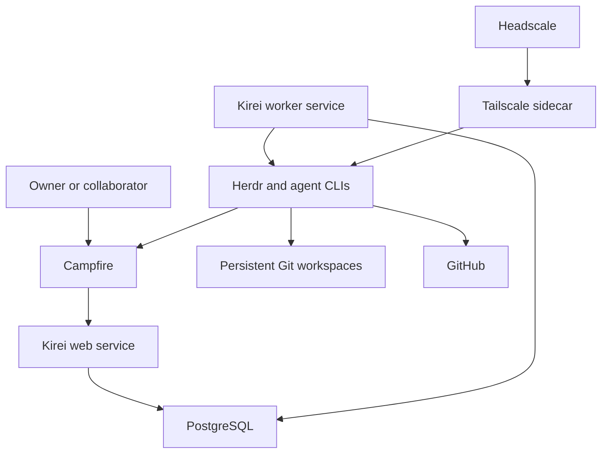

# Phase 0 — Agent fleet specification

Status: Draft for owner review

This document records the accepted Phase 0 decisions from the design interview.
It also lists the remaining decisions that the implementation plan must resolve.
[Phase 1 adds a voice interface to the controller](phase-1-voice-controller.md).

## 1. Outcome

Phase 0 provides a self-hosted agent fleet on one Linux server.
The owner controls project work through Campfire or an attached Herdr terminal.

Each project workflow uses a writer and a reviewer from different model families.
The system preserves specifications, plans, reviews, code, and research in Git.

The deployment includes a persistent master controller for general questions and fleet operations.
The controller uses the same local agent runtime as project work.

Separate deployments communicate only through Campfire and Git.
They do not share filesystems, databases, sockets, private networks, or controller APIs.

## 2. Phase boundary

Phase 0 validates one target environment and one deployment boundary.
All project agents share this boundary for the minimum viable product.

Phase 0 includes:

- Dockerized application services for one deployment.
- Campfire for human and agent chat.
- Herdr for agent lifecycle management.
- Codex CLI, Claude Code, OpenCode, and Gemini CLI.
- Wagglebot for agent and project configuration.
- A Kirei control plane.
- PostgreSQL for control state and durable jobs.
- GitHub as the initial Git forge.
- A configurable memory repository.
- Headscale and Tailscale for private Herdr access.
- Encrypted off-site backups.

Phase 0 excludes:

- Multi-server scheduling and cross-server orchestration.
- A second security boundary for individual projects or agents.
- A built-in issue tracker.
- Automatic pull request merge behavior.
- Automatic post-merge synchronization.
- Voice control.
- Scheduled memory grooming.
- Provider login through Campfire.
- Direct control APIs between independent deployments.

## 3. Hosting assumptions

The initial operator environment uses Ubuntu 24.04 LTS on AMD64.
The same application images can run on a compatible hosted container service.

Digitaltwin does not enforce a minimum server size.
The operator measures resource use and changes hosting capacity when necessary.

The operator supplies these external facilities:

- DNS records.
- TLS certificates through the existing reverse proxy.
- Secure public endpoint routing.
- The existing SSH bastion for raw server administration.

Each application image contains its direct application dependencies.

## 4. Container delivery model

The application repository owns its Dockerfiles and deployable container images.
It also documents environment, secret, volume, port, and health-check contracts.
The repository includes a Docker Compose file for local development and integration tests.
That file can start the required local dependencies with the application images.

The application repository pins runtime tools and packages to exact versions in checked-in manifests.
The infrastructure layer selects production application images by OCI digest.
The operator upgrades those versions through reviewed manifest changes and rebuilt images.

The infrastructure repository or hosting platform owns production orchestration.
This includes production Compose files, networks, volumes, routing, restart policies, and backup schedules.

An operator can supply Campfire as an existing hosted service.
If the operator deploys Campfire, the infrastructure layer uses its official image.

The application provides portable OCI images and environment configuration.
The images can run through Docker Compose, AWS ECS, or another compatible platform.

Phase 0 delivers a Kirei application image and an agent runtime image.
Campfire, PostgreSQL, Headscale, Tailscale networking, and S3 are external integration services.

The Kirei control plane is a modular monolith.
One application image runs as separate web and worker services.

An operator-supplied PostgreSQL service stores control state and durable jobs.
Kirei implements a jobs table and worker loop with short [`FOR UPDATE SKIP LOCKED`](https://www.postgresql.org/docs/current/sql-select.html) claims.
Workers use bounded retries, idempotency keys, leases, and expired-lease recovery.
Notifications can wake a worker, but job rows remain the durable source of truth.
The design does not require a separate queue service for Phase 0.

## 5. Service architecture

The Kirei application owns these modules:

- Campfire webhook ingestion and message delivery.
- Project enrollment and room mapping.
- Workflow state and approval gates.
- Agent session commands through Herdr.
- Review phase coordination.
- Master controller tools.
- Git and GitHub operations.
- Audit events and operational status.
- Durable job execution and retry behavior.

Herdr remains the provider abstraction and execution surface.
The control plane does not implement a task adapter for each agent CLI.
The worker uses [Herdr's Unix socket API](https://herdr.dev/docs/socket-api/) through a task-local shared volume.
The application pins the Herdr server and API schema to one compatible version.
Production orchestration places the Kirei worker and agent runtime on the same host or task.

## 6. Runtime boundary and persistence

Herdr and all agent CLIs run in one non-root runtime container.
All projects and agents share this accepted Phase 0 trust boundary.

The runtime container has these restrictions:

- No Docker socket.
- No privileged mode.
- No host root mount.
- Dropped Linux capabilities unless a measured requirement proves necessary.
- A non-root runtime user.
- Only required persistent volumes and network access.

The runtime declares persistent volumes for these items:

- Repository workspaces.
- The runtime user home.
- Herdr configuration and session metadata.
- Agent CLI login state.
- Wagglebot configuration.

Repository workspaces use `/workspace/repos` as the default root.
A repository slug determines its path under that root.

PostgreSQL maps each workflow role to its current Herdr pane and live agent alias.
Herdr aliases are runtime identifiers, not durable workflow identifiers.
After a restart, the worker reconciles those mappings with Herdr and Git state.
It treats Herdr's `unknown` state as uncertain, not as completion.

## 7. Supported agents

Phase 0 installs and pins these agent CLIs:

- Codex CLI.
- Claude Code.
- OpenCode.
- Gemini CLI.

The runtime image installs supported Herdr integrations for Codex, Claude Code, and OpenCode.
Gemini CLI uses Herdr's screen-state detection until Herdr supplies a native integration.
The local integration test verifies that each CLI starts through Herdr.

The operator signs in to each provider through an interactive terminal session.
The runtime persists the resulting login state.
Campfire does not implement a provider authentication flow.

Gemini CLI can start and monitor sessions through Herdr after integration validation.
Herdr does not guarantee native Gemini session restore.
The workflow restores context from committed artifacts when it starts a fresh Gemini session.

## 8. Writer and reviewer policy

Each workflow selects one writer configuration and one reviewer configuration.
Each configuration identifies a provider and model.

The writer and reviewer must use different underlying model providers and base model families.
Different CLI brands do not qualify when they use the same underlying model family.
The default configuration uses Codex as writer and Claude Code as reviewer.

The workflow records the CLI, model provider, model identifier, and model family for both roles.
It rejects a writer and reviewer pair that does not meet the diversity rule.

The owner can override both configurations for each workflow.
This supports changes based on cost, available usage, or task fit.

The writer and reviewer are workflow phases behind one project bot identity.
They are not separate Campfire accounts.

## 9. Wagglebot integration

Wagglebot provides the runtime user's global agent configuration.
It also provides project instructions, skills, agents, hooks, and compatible MCP configuration.

The runtime installs Wagglebot with its supported Node.js version.
The current Wagglebot baseline requires Node.js 22.20 or later, npm, and Git.

Initial server setup uses this supported sequence:

1. Install the pinned Wagglebot package.
2. Run `wagglebot connect <company-git-url>` as the runtime user.
3. Run `wagglebot update --wagglebot` as the runtime user.
4. Run `wagglebot init` for each enrolled project.
5. Run `wagglebot update` for each enrolled project.

Wagglebot uses the same persistent runtime home as the agent CLIs.
Its credentials remain outside Git.
The runtime image pins the Wagglebot version.
It updates Wagglebot only after an explicit operator command.

## 10. Campfire room model

One Campfire room represents one repository.
The room name uses the `owner/repository` GitHub slug.

One Campfire thread represents one project workflow.
The workflow identity binds the verified room ID and the verified thread ID.

One project room can have multiple active workflows in separate threads.
The system does not expose internal workflow identifiers in normal chat.

Different threads and project rooms can run workflows at the same time.
The application does not impose a fleet-wide concurrency limit.
The operator manages server capacity and future autoscaling.

The system stores the verified Campfire room ID, repository identity, and thread-to-workflow mapping in PostgreSQL.
This mapping survives a later room rename.

Task 1 must verify that the selected Campfire release supplies a server-authenticated thread ID or root-post ID.
The router must not derive a thread identity from message text or model output.

## 11. Campfire bot identities

The deployment uses two Campfire bot accounts:

- `@agent` is the master controller.
- `@worker` handles project workflow phases.

The exact account handles remain configurable for each deployment.
The default handles are `agent` and `worker` when those names are available.
An operator selects unique handles when multiple fleets use one Campfire instance.

Both bots have Campfire credentials and post their own messages.
The system does not require a separate reply relay command.

Each worker response identifies the active role.
For example, a response can label itself as writer or reviewer.

The message router ignores its own bot messages.
It deduplicates webhook deliveries before it starts work or posts a response.

## 12. Project enrollment and room mapping

The room slug maps directly to a workspace path.
For example, `swiknaba/wagglebot` maps to `/workspace/repos/swiknaba/wagglebot`.

The application stores the repository slug.
It derives the workspace path from the configured root and slug.

Before use, the application verifies these conditions:

- The derived path remains under the workspace root.
- The directory is a Git repository.
- The configured Git remote matches the repository slug.
- The Campfire room ID has the expected repository mapping.

If a room has no repository, the system asks the owner to select one action:

1. Clone the GitHub repository that matches the room name.
2. Create a private GitHub repository with that name, then clone it.
3. Stop and let the owner perform the setup.

The master controller can perform enrollment through a typed operation.
A simple shell command or function calls the same application service.

The operator supplies GitHub credentials with repository creation and push access.
The operator can use a personal account or a bot account.

## 13. Starting and routing project work

`@worker start` in a thread root post starts a fresh writer and reviewer workflow for that thread.
The command creates fresh underlying agent sessions and binds them to the verified thread identity.

The system rejects a second start in an active thread.
The owner must use a new thread for a new workflow.

Later human messages in an activated thread route to that workflow's active phase without another mention.
The active phase determines whether the writer or reviewer receives the message.

Messages outside an activated thread require an explicit `@worker start` in a new thread root post.
The system does not infer a workflow from an idle thread or an unactivated room message.

The owner explicitly closes a delivered workflow with `@worker finish` in its thread.
The command stops its Herdr sessions, records the outcome, and archives the session metadata.
It does not close a workflow from elapsed time, room silence, or an idle Herdr state.

`@worker cancel` explicitly terminates an incomplete workflow.
`@worker pause` and `@worker resume` remain thread-scoped and do not bypass workflow gates.
`unknown` and `missing` Herdr states block `finish` until reconciliation.
Cancellation records the requested stop and reconciles the final runtime state before archival.

## 14. Required project workflow

Every workflow creates and approves a specification and an implementation plan.
The base `AGENTS.md` also states this requirement for the agent.

The deterministic workflow has these gates:

1. The writer writes the specification.
2. The writer reports the exact specification commit as ready.
3. The reviewer reviews that specification commit.
4. The writer resolves the review findings and reports a new commit.
5. Steps 3 and 4 repeat until the reviewer approves or the gate becomes blocked.
6. The authorized human approves the exact reviewer-approved specification commit.
7. The writer writes the implementation plan.
8. The writer reports the exact plan commit as ready.
9. The reviewer reviews that plan commit.
10. The writer resolves the review findings and reports a new commit.
11. Steps 9 and 10 repeat until the reviewer approves or the gate becomes blocked.
12. The authorized human approves the exact reviewer-approved plan commit.
13. The writer implements the approved plan.
14. The writer reports the exact implementation commit as ready.
15. The reviewer reviews that implementation commit.
16. The writer resolves the review findings and reports a new commit.
17. Steps 15 and 16 repeat until the reviewer approves or the gate becomes blocked.
18. The writer opens or updates the final pull request.

One workflow branch contains its specification, plan, implementation, research, and review history.
The final result uses one pull request.

The owner reviews the pull request on GitHub.
The owner usually merges it with GitHub controls.

The application does not prescribe later merge or pull commands.
The owner can instruct an agent through normal conversation when those actions are necessary.

## 15. Approval enforcement

The Kirei control plane enforces separate specification and plan gates.
Agent instructions alone do not provide sufficient enforcement.

An approval records these fields:

- Campfire room and workflow identity.
- Artifact type.
- Exact Git commit.
- Authorized approver identity.
- Campfire message ID.
- Approval timestamp.

The control plane permits the next gate only when the required approval matches the current artifact commit.
Any artifact change invalidates its earlier approval.
The human approval gate accepts only a commit with an approving reviewer verdict.

The contextual approval command is `@worker approve`.
The command is unambiguous because the verified thread identifies one workflow.
Review findings and change requests use normal messages in that workflow thread.
The system does not define a separate rejection command.

The control plane records transitions and rejects invalid transitions.
The agent cannot bypass a gate through a prompt or a direct phase request.

## 16. Review protocol

The writer must stop changes while a review runs.
The control plane owns this exclusion rule.

For each review round, the control plane performs these actions:

1. Stop dispatching new project work prompts to the writer.
2. Send a review transition prompt to the writer.
3. Wait for its artifact-ready callback and exact commit.
4. Verify the commit, expected artifact, and clean Git worktree.
5. Wait until Herdr reports the writer as idle or done.
6. Lock the writer phase in PostgreSQL before the reviewer starts.
7. Give the reviewer the exact target commit and review file path.
8. Verify the reviewer changed only the review Markdown file.
9. Send the committed review path and commit to the writer.
10. Restore writer access for the correction phase.

The runtime image installs a small Digitaltwin command for artifact-ready callbacks.
The command uses the same Kirei application codebase.
The command reports the artifact type and exact Git commit to a private Kirei endpoint.
Kirei verifies the callback's session identity and current workflow phase.
The reviewer uses the same command to report a committed review verdict.
Herdr lifecycle events alone do not mark an artifact ready.

If the writer stays active or Herdr reports an uncertain state, the worker does not start review.
It reports the blocked transition in Campfire and waits for operator direction.

The workflow has one committed review file.
Each round appends one dated section to that file.

Each section records these fields:

- Reviewer CLI, model provider, model identifier, and model family.
- Target commit.
- Findings.
- Verdict.
- Timestamp.

The reviewer does not modify the reviewed artifact or implementation files.
The writer owns all corrective changes.

Each gate permits three unsuccessful review rounds.
After the third unsuccessful round, the workflow becomes blocked.
The worker asks an authorized human in Campfire how to continue.

## 17. Master controller

`@agent` routes messages from any room to one logical Gemini controller.
The controller receives the source room context with each request.

The controller is not bound to one repository.
It does not use the project specification and plan gates.

The controller runs Gemini CLI through Herdr.
It does not call the Gemini model API directly.

The controller uses typed Digitaltwin operations through a [local MCP bridge](https://github.com/google-gemini/gemini-cli/blob/main/docs/tools/mcp-server.md).
The bridge uses the same Kirei application codebase.
The bridge exposes a small set of tools to Gemini CLI and calls Kirei application operations.
Kirei validates arguments, sender authority, workflow state, and required confirmations.
Its operations include:

- Show projects, workflows, sessions, and Git state.
- Create or enroll a project.
- Start a project workflow.
- Send a prompt to an active phase.
- Pause, resume, finish, or cancel a workflow.
- Perform authorized Git and GitHub actions.
- Invoke deployment operations that the operator explicitly supplies as tools.
- Delete resources.
- Change credential configuration.

The controller can perform broad fleet operations.
It requests a second human confirmation before a destructive or irreversible action.
It never displays secret values.

After a restart, the system starts a fresh Gemini controller session.
The controller reconstructs current state from PostgreSQL and typed operations.

## 18. Human and peer authorization

Any room member can create ordinary work and send project instructions.
Peer agents can send instructions through explicit Campfire mentions.

Campfire owns user administration, room access, and room membership.
An authorized human is a room member whose Campfire user ID is not a configured bot identity.
Any authorized human can perform these actions:

- Approve a specification.
- Approve an implementation plan.
- Confirm a destructive or irreversible operation.

The system verifies the sender's Campfire user ID for human-only actions.
Configured local and peer bot identities cannot approve or confirm these actions.
Digitaltwin does not maintain a separate human allowlist.

## 19. Independent deployment collaboration

Independent deployments share only a Campfire room and a Git repository.
Each deployment keeps its own bot accounts, credentials, runtime, and control state.

Agents coordinate through explicit mentions in the shared room.
They exchange durable artifacts through branches, commits, and pull requests.

An agent handoff identifies these items:

- The intended bot recipient.
- The requested action.
- The repository slug.
- The relevant branch, commit, or pull request.

The receiving deployment verifies the repository and revision with its own credentials.
The receiving deployment never receives private filesystem or Herdr access.

Phase 0 tests this contract with a simulated peer bot and separate Git identity.
The acceptance test does not require a second full server deployment.

## 20. Memory model

Every deployment configures one memory repository slug.
The owner deployment can use `swiknaba/memory`, but the application does not hardcode it.

The repository slug determines the memory workspace path.
Each project also keeps its local `.agents/memory.md` file.

Memory maintenance occurs manually through `@agent` and base agent instructions.
The system does not use a memory cron job.
It does not require memory grooming after each session.

Small additive memory changes can commit directly to the default branch.
Substantial reorganizations use a branch and pull request.

## 21. Secrets and credentials

1Password is the preferred secret source.
It is not a required dependency.

Local development also supports an ignored `.env` file.
The repository can store `op://` references, but it never stores plaintext secrets.

The infrastructure layer materializes production runtime environment files with root ownership and mode `0600`.
It does not place those files in a synchronized or committed directory.

The runtime persists interactive CLI login state.
The backup system excludes that login state.
An operator signs in again after a disaster recovery.

## 22. Private Herdr access

The existing SSH bastion remains the path for raw Hetzner server administration.
It does not provide the Herdr tunnel.

The infrastructure layer supplies Headscale and a Tailscale sidecar for private runtime access.
The runtime runs OpenSSH for Herdr terminal attachment.

The runtime contract does not require a public SSH port.
The infrastructure layer does not publish that port to the public internet.

Headscale uses a dedicated DNS-only hostname through Traefik.
It uses a publicly trusted TLS certificate.

The Headscale endpoint does not use Cloudflare Proxy or Cloudflare Tunnel.
Campfire can remain behind the existing Cloudflare protection.

## 23. Backup scope

The infrastructure layer sends encrypted backups to an operator-configured S3-compatible bucket.
It runs one backup each day.
A single missed daily backup is acceptable.
The infrastructure layer sends a Campfire alert after two consecutive backup failures.
It uses an operator-configured Campfire webhook for that alert.

The bucket lifecycle expires backup objects after 30 days.
Digitaltwin does not schedule backups, delete old backups, or manage retention generations.
Daily operation produces approximately 30 retained backups when all runs succeed.

The infrastructure layer supplies the client-side encryption key through 1Password or `.env`.
It never stores the encryption key in the backup bucket.

Backups include:

- PostgreSQL data.
- Campfire data and attachments.
- Herdr configuration and session metadata.
- Digitaltwin configuration and audit data.
- Headscale state.

Backups exclude:

- Repository workspaces.
- Unpushed repositories and commits.
- Agent CLI login credentials.

Git provides the recovery source for pushed project and memory repository data.
The operator accepts the loss of unpushed repository work after a server loss.

The operator performs one restore test during initial deployment.
The operator repeats the test after a backup configuration change.
Digitaltwin does not schedule recurring restore tests.

## 24. Monitoring and recovery

Each image supplies a health-check contract.
The infrastructure layer defines automatic restart policies and bounded log storage.

The infrastructure layer reports two consecutive backup failures through its Campfire webhook.
It does not include Prometheus, Grafana, or a separate alerting stack.

Host monitoring and host-level alerts remain operator concerns.

## 25. Phase 0 acceptance criteria

Phase 0 is acceptable when all criteria in this section pass.

1. The published application images start in the existing infrastructure environment.
2. Local development and integration tests run through the repository's Compose file.
3. The same image contracts support production Compose and a hosted container platform.
4. Campfire, PostgreSQL, Kirei web, Kirei worker, Herdr runtime, Headscale, and Tailscale report healthy states.
5. The documented runtime contract requires no Docker socket, privileged mode, or host root mount.
6. The runtime process uses a non-root user.
7. A host restart preserves repositories, Herdr state, Wagglebot state, and CLI login state.
8. Each of the four supported agent CLIs starts through Herdr.
9. The operator can attach to Herdr through the private tailnet.
10. The public internet cannot connect directly to the runtime SSH port.
11. `@agent` messages from any room reach the master controller with source room context.
12. `@worker start` creates fresh writer and reviewer sessions for the mapped repository.
13. A second start request requires confirmation when the earlier session actively works.
14. A room slug maps to the expected repository path under the configured workspace root.
15. A missing repository offers clone, private creation, and stop choices.
16. The chat flow and shell command use the same enrollment service.
17. A writer cannot implement before approval of the exact specification and plan commits.
18. An artifact change invalidates its earlier approval.
19. A configured bot identity cannot approve a specification or plan.
20. A reviewer targets an exact commit and changes only the review Markdown file.
21. The validated Herdr handshake blocks review until the writer reports readiness and reaches a settled state.
22. The writer cannot receive work prompts while its artifact is under review.
23. The writer receives the committed review path and commit after review completion.
24. Three unsuccessful rounds at one gate block the workflow and request human direction.
25. The final workflow uses one branch and one pull request.
26. The application does not merge the pull request without a direct conversational instruction.
27. A master restart creates a fresh Gemini session and restores status from durable state.
28. A simulated peer bot completes a handoff through only Campfire and Git.
29. An encrypted backup restores all included services without restoring excluded CLI credentials.
30. The owner can complete an agent interview from a mobile Campfire client.
31. A research workflow produces committed Markdown with sources and stated uncertainty.
32. A workflow can commit and push a durable memory update to the configured memory repository.

## 26. Implementation validation

The remaining work concerns validation of the selected interfaces.
The implementation plan must include these validation steps:

1. Validate Herdr socket methods and state reporting against the pinned Herdr release.
2. Validate the writer idle handshake with each supported agent CLI.
3. Validate Gemini CLI startup and MCP tool calls through Herdr.

## 27. Superseded decisions

The following earlier ideas no longer apply:

- Run Herdr directly on the host.
- Use a dedicated host user as the main agent isolation boundary.
- Permit small work without a specification and plan.
- Run a periodic memory master.
- Limit application concurrency as a Phase 0 control-plane feature.
- Give a controller direct access to another deployment.
- Test collaboration with two complete server stacks.
- Use separate Campfire accounts for writer and reviewer.
- Automate pull request merge or post-merge synchronization.
