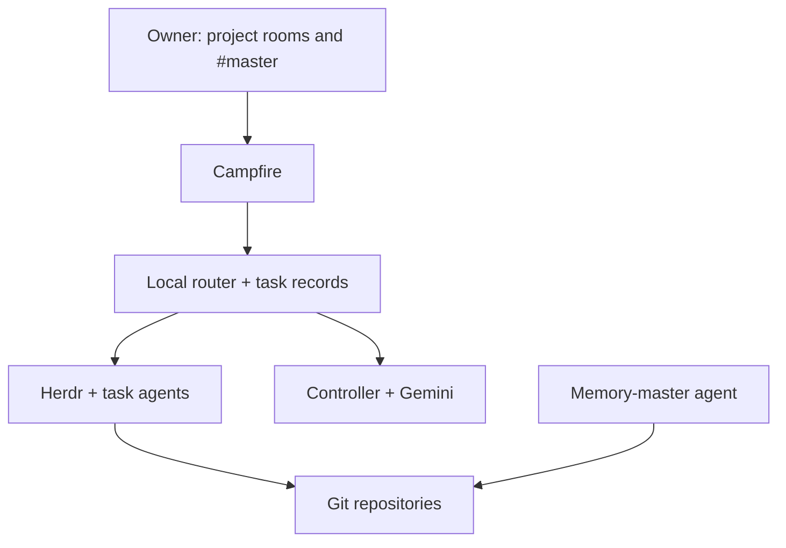

# Phase 0 — Agent fleet architecture and review decisions

This is the Phase 0 specification for a self-hosted fleet that can interview its owner, carry out coding and research tasks, preserve useful knowledge, and collaborate with another independently operated fleet. [Phase 1 adds a voice interface to the controller](phase-1-voice-controller.md).

## Goals and accepted boundaries

- Instruct agents from a mobile project room or a desktop terminal. Agents use repository instructions, skills, and runbooks to interview the owner as needed, then produce reviewable work.
- Code and research outcomes are committed to Git. Project agents write useful knowledge to the memory repository; a memory-master agent curates it.
- A Gemini-backed controller in `#master` can show progress across enrolled projects and direct authorized tasks. The controller model and task-agent model/provider can be replaced independently.
- Each deployment is one permission boundary. A second owner runs an independent stack. For a shared project, the two fleets may coordinate in a shared room and Git repository after their owners initiate collaboration.
- Campfire, Herdr, the router/controller, Headscale, and the other server-side infrastructure are open source and self-hosted. Codex CLI, Claude Code, and other agent/model providers are expressly allowed regardless of their licensing. Use the open-source Tailscale client components with self-hosted Headscale.
- GitHub Free is the approved Git host for now. Use ordinary Git remotes and a forge adapter so a self-hosted Git service can replace GitHub later. The choice of Git host is not a Phase 0 blocker. Git backs artifacts and durable task decisions; live queues and delivery cursors may use a local database.

## Components and authority

| Component | Responsibility |
| --- | --- |
| Campfire PWA and bot API | Human and agent conversation, explicit mentions, status messages, and links to artifacts. |
| Router | Authenticates and routes messages to the correct task and agent; persists delivery IDs and session mappings. |
| Herdr | Local workspace, pane, agent lifecycle, status, and SSH attachment. It is an execution surface, not the global task authority. |
| Task records | One Markdown file per task in the relevant project Git repository; durable objective, state, decisions, and artifact links. |
| Controller | Aggregates enrolled stack status and offers typed task/status operations in `#master`. Gemini is its first reasoning interface. |
| Memory-master | Periodically organizes and checks the memory repository; exposes relevant knowledge to future tasks. |
| Git forge | Stores code, research Markdown, memory, branches, reviews, and immutable revisions. GitHub now; replaceable later. |

Each stack owns its workspaces, Herdr socket, service account, bot identity, and repository credentials. The controller enrolls stacks with scoped status and command access. It does not gain their filesystem or Herdr socket access. A stack reports task state, agent state, last activity, branch/commit/PR, blocker, and verification evidence; stale/unreachable status is labeled as such.

## Task lifecycle without an issue tracker

An issue tracker is optional. For Phase 0, use `tasks/<task-id>.md` in the project repository as the canonical task record, with a short front matter header and an append-only progress/decision log. Example fields: `id`, `project`, `room_id`, `thread_or_root_message_id`, `assignee`, `status`, `branch`, `approved_spec_commit`, and `updated_at`. The body holds the objective, answers from the interview, acceptance criteria, progress, blockers, deliverables, and evidence.

A practical state path is `interview → plan/review → approved → working → verification → done`, with `blocked` and `cancelled` available from any active state. A small local database can track webhook delivery IDs, task-to-Herdr mappings, and retries; task records and decisions are committed to Git. Reconcile local state against Git and Herdr after a restart. Do not turn the shared `CHANGELOG.md` into a queue: keep its current role as a human-readable summary of completed changes, with links to task records or commits.

The router records which message belongs to which task. A project room identifies a repository; it does not identify the active pane. New tasks and agent handoffs use explicit bot mentions because Campfire's bot webhook fires on mention or ping. The router checks the sender, ignores its own messages, deduplicates deliveries, and routes replies to the matching task.

## Interview, execution, and completion

The existing base prompts, skills, `AGENTS.md`, and project runbook define how an agent interviews the owner, plans work, tests it, and reports results. Keep those as the behavioral rules; the control plane records the resulting states and artifacts. A task may skip a formal plan when the runbook allows it.

An approval names the task, action, and exact spec/plan commit. Completion requires the runbook's evidence, not merely an idle agent pane. For code this may be tests, a diff, and a PR; for research it may be a Markdown report with source links, access dates, and stated uncertainty. The agent posts a concise result and artifact links to its task conversation. Merge, deployment, or other external effects follow the project's authorization rules.

Agents need project-scoped tools for their assigned work: shell and repository access for coding; search, page/PDF retrieval, and citation capture for research. A tool or model provider can change without changing the task record and handoff protocol.

## Controller in `#master`

The controller uses typed operations such as `list_projects`, `list_tasks`, `get_task`, `request_status_update`, and `create_task`. It retrieves relevant task history on demand instead of loading every transcript into Gemini's context. Owner-authorized requests may assign a task to a project router; actions outside that project's scope return for a human decision. It reports blocked, completed, and stale work with links and timestamps, and can proactively notify the owner when an agent needs input or a requested deliverable is ready.

Herdr provides local agent state and controls; it does not supply the cross-stack project registry. The controller's status and authorization logic stays deterministic and model-independent.

## Memory capture and grooming

A project runbook tells agents when and what to write to the memory repository. The task record links the memory commit or explicitly says that no durable memory was needed. The router verifies that required memory updates were committed and pushed before closing a task.

The memory-master runs periodically and may also receive task-completion events. It reviews new notes, merges duplicates, improves titles and links, moves material into appropriate folders, records provenance, and maintains a lightweight index for retrieval. It writes changes on a branch and follows the memory repository's review rules for substantial reorganization. It must preserve source material and avoid inventing facts while summarizing. Project agents retrieve relevant notes on demand; they do not load the whole vault into every prompt.

## Collaboration between independent stacks

For an agreed shared project, use one Campfire instance with a shared project room. Each owner and each fleet's bot joins that room; both routers remain local to their own stacks. The owners initiate and scope the collaboration. After that, agents may address one another with explicit `@mentions`, agree on subtasks in chat, and continue exchanging work without a human relaying each turn.

Each handoff names the shared task, intended recipient, requested action, and Git branch/commit or PR. The recipient verifies the sender and repository, fetches the referenced revision with its own credentials, and answers in the same task conversation. Chat carries coordination; Git carries documents and code. The routers deduplicate handoffs, track pending replies, retry or surface failures, and avoid bot loops. Agents ask the owners when work exceeds the agreed scope or they cannot resolve a disagreement. Neither fleet has access to the other's private projects, Herdr socket, or filesystem.

## Operations and acceptance

Run services under distinct identities, keep secrets out of Git, restrict Herdr sockets locally, and use Headscale for private server access. Define how the iPhone reaches Campfire and how missed messages are recovered. Limit concurrent tasks per stack, allow pause/cancel, and surface crashes and prolonged blockers to the owner. Back up the local router/controller state; Git remains the recoverable source for task records and deliverables.

Phase 0 is acceptable when the owner can start two concurrent tasks, answer an interview from mobile, approve a specific revision, receive verified code and research Markdown, find a committed memory update, and get accurate status in `#master` after a disconnect/restart. In a second test, two independent stacks complete a shared task through Campfire and Git without exposing their private workspaces.

## Review decisions

The initial review's routing, approval, recovery, and cross-stack findings are incorporated above. The agreed simplifications are: Markdown task files instead of an issue tracker; existing prompts/skills/runbooks for behavior; natural agent-to-agent coordination over Campfire with explicit Git handoffs; a periodic memory-master; GitHub Free as the current swappable host; and the approved agent CLIs plus Headscale networking.
