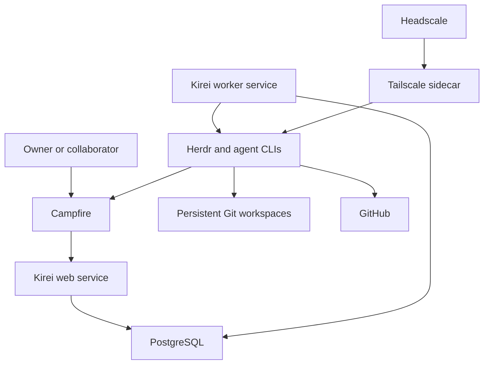

# Phase 0 — Agent fleet specification

Status: Draft for owner review

This document records the accepted Phase 0 decisions from the design interview.
It also lists the remaining decisions that the implementation plan must resolve.
[Phase 1 adds a voice interface to the controller](phase-1-voice-controller.md).

## 1. Outcome

Phase 0 provides a self-hosted agent fleet on one Linux server.
The owner controls project work through Campfire or an attached Herdr terminal.

Each project workflow uses a writer and a reviewer from different model families.
The system preserves specifications, plans, reviews, code, and research in Git.

The deployment includes a persistent master controller for general questions and fleet operations.
The controller uses the same local agent runtime as project work.

Separate deployments communicate only through Campfire and Git.
They do not share filesystems, databases, sockets, private networks, or controller APIs.

## 2. Phase boundary

Phase 0 covers one server and one deployment boundary.
All project agents share this boundary for the minimum viable product.

Phase 0 includes:

- One Ubuntu server deployment.
- Campfire for human and agent chat.
- Herdr for agent lifecycle management.
- Codex CLI, Claude Code, OpenCode, and Gemini CLI.
- Wagglebot for agent and project configuration.
- A Kirei control plane.
- PostgreSQL for control state and durable jobs.
- GitHub as the initial Git forge.
- A configurable memory repository.
- Headscale and Tailscale for private Herdr access.
- Encrypted off-site backups.

Phase 0 excludes:

- Multiple server orchestration.
- A second security boundary for individual projects or agents.
- A built-in issue tracker.
- Automatic pull request merge behavior.
- Automatic post-merge synchronization.
- Voice control.
- Scheduled memory grooming.
- Provider login through Campfire.
- Direct control APIs between independent deployments.

## 3. Server baseline

The initial server uses Ubuntu 24.04 LTS on AMD64.
The current Hetzner server has two virtual CPUs, 4 GB RAM, and 80 GB storage.

The implementation plan must define the minimum supported server size.
The owner can resize the server when the measured load requires more resources.

The operator supplies these external facilities:

- DNS records.
- TLS certificates through the existing reverse proxy.
- Secure public endpoint routing.
- The existing SSH bastion for raw server administration.

The deployment installs every direct application dependency.

## 4. Deployment model

The application repository owns its Dockerfiles and complete Docker Compose configuration.
The infrastructure repository owns a thin Hetzner deployment wrapper.

The deployment follows the existing infrastructure repository pattern.
It uses Docker Compose and pinned container image versions.

Campfire uses its official image.
The deployment does not use ONCE or build Campfire from source.

The application uses portable OCI images and environment configuration.
This design permits a later move to AWS ECS or another container platform.

The Kirei control plane is a modular monolith.
One application image runs as separate web and worker services.

PostgreSQL stores control state and durable jobs.
The design does not require a separate queue service for Phase 0.

## 5. Service architecture

The Kirei application owns these modules:

- Campfire webhook ingestion and message delivery.
- Project enrollment and room mapping.
- Workflow state and approval gates.
- Agent session commands through Herdr.
- Review phase coordination.
- Master controller tools.
- Git and GitHub operations.
- Audit events and operational status.
- Durable job execution and retry behavior.

Herdr remains the provider abstraction and execution surface.
The control plane does not implement a task adapter for each agent CLI.

## 6. Runtime boundary and persistence

Herdr and all agent CLIs run in one non-root runtime container.
All projects and agents share this accepted Phase 0 trust boundary.

The runtime container has these restrictions:

- No Docker socket.
- No privileged mode.
- No host root mount.
- Dropped Linux capabilities unless a measured requirement proves necessary.
- A non-root runtime user.
- Only required persistent volumes and network access.

The deployment persists these items across container and host restarts:

- Repository workspaces.
- The runtime user home.
- Herdr configuration and session metadata.
- Agent CLI login state.
- Wagglebot configuration.

Repository workspaces use `/workspace/repos` as the default root.
A repository slug determines its path under that root.

## 7. Supported agents

Phase 0 installs and pins these agent CLIs:

- Codex CLI.
- Claude Code.
- OpenCode.
- Gemini CLI.

The deployment installs the corresponding Herdr integrations.
It verifies each CLI through a startup health check or deployment check.

The operator signs in to each provider through an interactive terminal session.
The runtime persists the resulting login state.
Campfire does not implement a provider authentication flow.

Gemini CLI can start and monitor sessions through Herdr.
If Herdr cannot restore a native Gemini session, the workflow restores context from committed artifacts.

## 8. Writer and reviewer policy

Each workflow selects one writer configuration and one reviewer configuration.
Each configuration identifies a provider and model.

The writer and reviewer must use different providers and different base model families.
The default configuration uses Codex as writer and Claude Code as reviewer.

The owner can override both configurations for each workflow.
This supports changes based on cost, available usage, or task fit.

The writer and reviewer are workflow phases behind one project bot identity.
They are not separate Campfire accounts.

## 9. Wagglebot integration

Wagglebot provides the runtime user's global agent configuration.
It also provides project instructions, skills, agents, hooks, and compatible MCP configuration.

The runtime installs Wagglebot with its supported Node.js version.
The current Wagglebot baseline requires Node.js 22.20 or later, npm, and Git.

Initial server setup uses this supported sequence:

1. Install the pinned Wagglebot package.
2. Run `wagglebot connect <company-git-url>` as the runtime user.
3. Run `wagglebot update --wagglebot` as the runtime user.
4. Run `wagglebot init` for each enrolled project.
5. Run `wagglebot update` for each enrolled project.

Wagglebot uses the same persistent runtime home as the agent CLIs.
Its credentials remain outside Git.

## 10. Campfire room model

One Campfire room represents one repository.
The room name uses the `owner/repository` GitHub slug.

One project room has one linear workflow at a time.
The system does not expose task identifiers in normal chat.

Different project rooms can run workflows at the same time.
The application does not impose a fleet-wide concurrency limit.
The operator manages server capacity and future autoscaling.

The system stores the verified Campfire room ID and repository identity in PostgreSQL.
This mapping survives a later room rename.

## 11. Campfire bot identities

The deployment uses two Campfire bot accounts:

- `@agent` is the master controller.
- `@worker` handles project workflow phases.

The exact account handles remain configurable.
The labels above describe the default handles for one deployment.

Both bots have Campfire credentials and post their own messages.
The system does not require a separate reply relay command.

Each worker response identifies the active role.
For example, a response can label itself as writer or reviewer.

The message router ignores its own bot messages.
It deduplicates webhook deliveries before it starts work or posts a response.

## 12. Project enrollment and room mapping

The room slug maps directly to a workspace path.
For example, `swiknaba/wagglebot` maps to `/workspace/repos/swiknaba/wagglebot`.

The application stores the repository slug.
It derives the workspace path from the configured root and slug.

Before use, the application verifies these conditions:

- The derived path remains under the workspace root.
- The directory is a Git repository.
- The configured Git remote matches the repository slug.
- The Campfire room ID has the expected repository mapping.

If a room has no repository, the system asks the owner to select one action:

1. Clone the GitHub repository that matches the room name.
2. Create a private GitHub repository with that name, then clone it.
3. Stop and let the owner perform the setup.

The master controller can perform enrollment through a typed operation.
A simple shell command or function calls the same application service.

The operator supplies GitHub credentials with repository creation and push access.
The operator can use a personal account or a bot account.

## 13. Starting and routing project work

`@worker start` starts a fresh writer and reviewer workflow.
The command creates fresh underlying agent sessions.

If an earlier session actively works, the bot asks for confirmation before replacement.
Otherwise, the system stops or archives the old session and starts the new workflow.

Later `@worker` messages route to the active phase.
The active phase determines whether the writer or reviewer receives the message.

The project chat can remain inactive without an explicit finish command.
The system does not infer a new workflow from an idle-room message.

## 14. Required project workflow

Every workflow creates and approves a specification and an implementation plan.
The base `AGENTS.md` also states this requirement for the agent.

The deterministic workflow has these gates:

1. The writer writes the specification.
2. The writer reports the exact specification commit as ready.
3. The reviewer reviews that specification commit.
4. The writer resolves the review findings and reports a new commit.
5. Steps 3 and 4 repeat until the reviewer approves or the gate becomes blocked.
6. The authorized human approves the exact reviewer-approved specification commit.
7. The writer writes the implementation plan.
8. The writer reports the exact plan commit as ready.
9. The reviewer reviews that plan commit.
10. The writer resolves the review findings and reports a new commit.
11. Steps 9 and 10 repeat until the reviewer approves or the gate becomes blocked.
12. The authorized human approves the exact reviewer-approved plan commit.
13. The writer implements the approved plan.
14. The writer reports the exact implementation commit as ready.
15. The reviewer reviews that implementation commit.
16. The writer resolves the review findings and reports a new commit.
17. Steps 15 and 16 repeat until the reviewer approves or the gate becomes blocked.
18. The writer opens or updates the final pull request.

One workflow branch contains its specification, plan, implementation, research, and review history.
The final result uses one pull request.

The owner reviews the pull request on GitHub.
The owner usually merges it with GitHub controls.

The application does not prescribe later merge or pull commands.
The owner can instruct an agent through normal conversation when those actions are necessary.

## 15. Approval enforcement

The Kirei control plane enforces separate specification and plan gates.
Agent instructions alone do not provide sufficient enforcement.

An approval records these fields:

- Campfire room and workflow identity.
- Artifact type.
- Exact Git commit.
- Authorized approver identity.
- Campfire message ID.
- Approval timestamp.

The control plane permits the next gate only when the required approval matches the current artifact commit.
Any artifact change invalidates its earlier approval.
The human approval gate accepts only a commit with an approving reviewer verdict.

The proposed contextual approval command is `@worker approve`.
The command is unambiguous because one room has one active workflow.

The control plane records transitions and rejects invalid transitions.
The agent cannot bypass a gate through a prompt or a direct phase request.

## 16. Review protocol

The writer must stop changes while a review runs.
The control plane owns this exclusion rule.

For each review round, the control plane performs these actions:

1. Send a review-start notification to the writer.
2. Wait until the writer reaches a safe idle point.
3. Block new writer prompts for the reviewed artifact.
4. Give the reviewer the exact target commit.
5. Restrict the reviewer to one review Markdown file.
6. Wait for the committed review result.
7. Send the review path and commit to the writer.
8. Restore writer access for the correction phase.

The workflow has one committed review file.
Each round appends one dated section to that file.

Each section records these fields:

- Reviewer provider and model.
- Target commit.
- Findings.
- Verdict.
- Timestamp.

The reviewer does not modify the reviewed artifact or implementation files.
The writer owns all corrective changes.

Each gate permits three unsuccessful review rounds.
After the third unsuccessful round, the workflow becomes blocked.
The worker asks an authorized human in Campfire how to continue.

## 17. Master controller

`@agent` routes messages from any room to one persistent Gemini controller.
The controller receives the source room context with each request.

The controller is not bound to one repository.
It does not use the project specification and plan gates.

The controller runs Gemini CLI through Herdr.
It does not call the Gemini model API directly.

The controller uses typed Digitaltwin operations through a Kirei tool bridge.
Its operations include:

- Show projects, workflows, sessions, and Git state.
- Create or enroll a project.
- Start a project workflow.
- Send a prompt to an active phase.
- Pause, resume, or cancel a workflow.
- Perform authorized Git and GitHub actions.
- Perform authorized deployment actions.
- Delete resources.
- Change credential configuration.

The controller can perform broad fleet operations.
It requests a second human confirmation before a destructive or irreversible action.
It never displays secret values.

After a restart, the system starts a fresh Gemini controller session.
The controller reconstructs current state from PostgreSQL and typed operations.

## 18. Human and peer authorization

Any room member can create ordinary work and send project instructions.
Peer agents can send instructions through explicit Campfire mentions.

Only an authorized human owner can perform these actions:

- Approve a specification.
- Approve an implementation plan.
- Confirm a destructive or irreversible operation.
- Change the authorization configuration.

The system verifies Campfire user identity for privileged messages.
It does not infer authority from message text or an agent claim.

## 19. Independent deployment collaboration

Independent deployments share only a Campfire room and a Git repository.
Each deployment keeps its own bot accounts, credentials, runtime, and control state.

Agents coordinate through explicit mentions in the shared room.
They exchange durable artifacts through branches, commits, and pull requests.

An agent handoff identifies these items:

- The intended bot recipient.
- The requested action.
- The repository slug.
- The relevant branch, commit, or pull request.

The receiving deployment verifies the repository and revision with its own credentials.
The receiving deployment never receives private filesystem or Herdr access.

Phase 0 tests this contract with a simulated peer bot and separate Git identity.
The acceptance test does not require a second full server deployment.

## 20. Memory model

Every deployment configures one memory repository slug.
The owner deployment can use `swiknaba/memory`, but the application does not hardcode it.

The repository slug determines the memory workspace path.
Each project also keeps its local `.agents/memory.md` file.

Memory maintenance occurs manually through `@agent` and base agent instructions.
The system does not use a memory cron job.
It does not require memory grooming after each session.

Small additive memory changes can commit directly to the default branch.
Substantial reorganizations use a branch and pull request.

## 21. Secrets and credentials

1Password is the preferred secret source.
It is not a required dependency.

The deployment also supports an ignored `.env` file.
The repository can store `op://` references, but it never stores plaintext secrets.

The deployment materializes runtime environment files with root ownership and mode `0600`.
It does not place those files in a synchronized or committed directory.

The runtime persists interactive CLI login state.
The backup system excludes that login state.
An operator signs in again after a disaster recovery.

## 22. Private Herdr access

The existing SSH bastion remains the path for raw Hetzner server administration.
It does not provide the Herdr tunnel.

Headscale and a Tailscale sidecar provide private access to the runtime container.
The runtime runs OpenSSH for Herdr terminal attachment.

The deployment does not publish the runtime SSH port to the public internet.

Headscale uses a dedicated DNS-only hostname through Traefik.
It uses a publicly trusted TLS certificate.

The Headscale endpoint does not use Cloudflare Proxy or Cloudflare Tunnel.
Campfire can remain behind the existing Cloudflare protection.

## 23. Backup scope

The deployment sends encrypted backups to an S3-compatible object store.

Backups include:

- PostgreSQL data.
- Campfire data and attachments.
- Herdr configuration and session metadata.
- Digitaltwin configuration and audit data.
- Headscale state.

Backups exclude:

- Repository workspaces.
- Unpushed repositories and commits.
- Agent CLI login credentials.

Git provides the recovery source for pushed project and memory repository data.
The operator accepts the loss of unpushed repository work after a server loss.

## 24. Phase 0 acceptance criteria

Phase 0 is acceptable when all criteria in this section pass.

1. A clean Ubuntu 24.04 LTS server can start the full stack with the documented deployment procedure.
2. The stack starts from the application Compose file through the infrastructure wrapper.
3. Campfire, PostgreSQL, Kirei web, Kirei worker, Herdr runtime, Headscale, and Tailscale report healthy states.
4. The runtime has no Docker socket, privileged mode, or host root mount.
5. The runtime process uses a non-root user.
6. A host restart preserves repositories, Herdr state, Wagglebot state, and CLI login state.
7. Each of the four supported agent CLIs starts through Herdr.
8. The operator can attach to Herdr through the private tailnet.
9. The public internet cannot connect directly to the runtime SSH port.
10. `@agent` messages from any room reach the master controller with source room context.
11. `@worker start` creates fresh writer and reviewer sessions for the mapped repository.
12. A second start request requires confirmation when the earlier session actively works.
13. A room slug maps to the expected repository path under the configured workspace root.
14. A missing repository offers clone, private creation, and stop choices.
15. The chat flow and shell command use the same enrollment service.
16. A writer cannot implement before approval of the exact specification and plan commits.
17. An artifact change invalidates its earlier approval.
18. Only an authorized human can approve a specification or plan.
19. A reviewer targets an exact commit and changes only the review Markdown file.
20. The writer cannot receive work prompts while its artifact is under review.
21. The writer receives the committed review path and commit after review completion.
22. Three unsuccessful rounds at one gate block the workflow and request human direction.
23. The final workflow uses one branch and one pull request.
24. The application does not merge the pull request without a direct conversational instruction.
25. A master restart creates a fresh Gemini session and restores status from durable state.
26. A simulated peer bot completes a handoff through only Campfire and Git.
27. An encrypted backup restores all included services without restoring excluded CLI credentials.
28. The owner can complete an agent interview from a mobile Campfire client.
29. A research workflow produces committed Markdown with sources and stated uncertainty.
30. A workflow can commit and push a durable memory update to the configured memory repository.

## 25. Remaining design decisions

The implementation plan must not silently choose these items.
Resolve them during the next interview session.

1. Select the minimum CPU, memory, disk, and swap configuration.
2. Select the exact image and package version pinning policy.
3. Select the Wagglebot update policy after initial setup.
4. Select the exact Kirei durable job implementation.
5. Select the Herdr command interface and session state mapping.
6. Select the Kirei tool bridge protocol for the master controller.
7. Select the exact `@worker approve` syntax and rejection syntax.
8. Define the safe idle signal before a writer review lock.
9. Define the Campfire authorization list and collaborator privilege rules.
10. Define bot handle namespacing for multiple fleets in one Campfire instance.
11. Define Headscale device enrollment, access grants, and SSH authorization.
12. Select the S3-compatible backup provider, schedule, retention, and encryption key custody.
13. Define the restore test frequency and the required recovery objectives.
14. Define monitoring, log retention, alert delivery, and service recovery behavior.
15. Define the callback or event that reports an artifact and exact commit as ready.
16. Define whether provider identity refers to the CLI vendor, model vendor, or both.

## 26. Superseded decisions

The following earlier ideas no longer apply:

- Run Herdr directly on the host.
- Use a dedicated host user as the main agent isolation boundary.
- Permit small work without a specification and plan.
- Run multiple identified tasks inside one project room.
- Route replies through task identifiers.
- Run a periodic memory master.
- Limit application concurrency as a Phase 0 control-plane feature.
- Give a controller direct access to another deployment.
- Test collaboration with two complete server stacks.
- Use separate Campfire accounts for writer and reviewer.
- Require a worker finish command.
- Automate pull request merge or post-merge synchronization.
