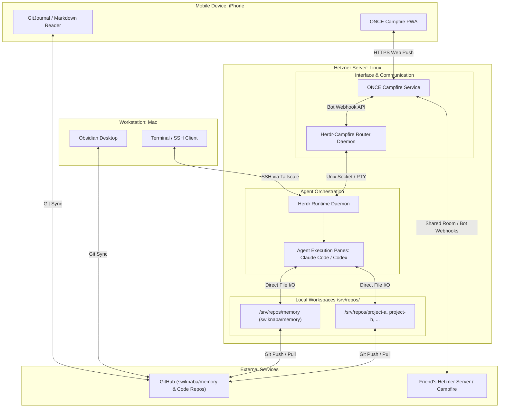

# Agent Fleet and Knowledge Ingestion Architecture Specification

## 1. Overview and Goals

This specification defines a self-hosted, vendor-independent environment for orchestrating autonomous coding agents. The system serves two primary functions:
1. Executing general software engineering tasks across multiple repositories.
2. Managing and ingesting research into a personal, Git-backed Obsidian vault (`swiknaba/memory`).

### Key Invariants
* **Zero Additional Subscriptions**: Uses existing Hetzner infrastructure and existing Claude/ChatGPT Enterprise seats.
* **100% Permissive / Open-Source Tooling**: All runtime and orchestration components use MIT, Apache 2.0, or standard Linux licenses.
* **Dual Ingress**: Mobile chat operations via Progressive Web App (PWA) and deep desktop control via SSH terminal multiplexing.
* **Git as Source of Truth**: All long-form text, code, specifications, and notes live in version control.

---

## 2. System Architecture



---

## 3. Component Stack and Licensing

| Component | Software / Tool | License | Purpose |
| :--- | :--- | :--- | :--- |
| **Host System** | Debian / Ubuntu Linux on Hetzner VPS | Open Source | Base compute platform. |
| **Agent Orchestrator** | Herdr (`herdrdev/herdr`) | Apache 2.0 | Terminal workspace management, process lifecycle, and socket API. |
| **Chat / Mobile UI** | ONCE Campfire (`basecamp/once-campfire`) | MIT | Channel-based mobile communication and Web Push notifications. |
| **Integration Adapter** | Custom Router Daemon | MIT | Bidirectional bridge between Campfire Bot API and Herdr socket. |
| **Coding Agents** | Claude Code CLI & OpenAI Codex CLI | Proprietary | Autonomous agents authenticated via flat enterprise subscriptions. |
| **Secure Networking** | Tailscale (or WireGuard / OpenSSH) | BSD-3 / GPLv2 | Encrypted desktop-to-server access without public port exposure. |
| **Mobile Reader** | GitJournal (or Working Copy) | GPLv3 | Clean offline reading of Markdown notes on iPhone. |

---

## 4. Authentication and Billing

1. **Claude Code**:
   * Authenticate via browser OAuth using `claude /login`.
   * Unset `ANTHROPIC_API_KEY` on the server.
   * Usage consumes existing Enterprise plan allocation with zero metered token fees.
2. **Codex CLI**:
   * Authenticate via browser OAuth using `codex login`.
   * Unset `OPENAI_API_KEY` on the server.
   * Usage consumes existing ChatGPT Enterprise plan allocation.

---

## 5. Workspaces and Routing Model

### Directory Layout on Hetzner Server
```text
/srv/repos/
├── memory/                  # Checkout of swiknaba/memory (Obsidian vault)
│   └── notes/
├── project-alpha/           # Software repository A
└── project-beta/            # Software repository B
```

### Channel-to-Project Convention
* Campfire rooms map 1:1 with repository names:
  * `#memory` $\rightarrow$ `/srv/repos/memory`
  * `#project-alpha` $\rightarrow$ `/srv/repos/project-alpha`
* Sending a message in a room targets that specific repository.

---

## 6. Interaction Workflows

### 6.1 Task Inception and Requirements Interview (Mobile)
1. **User Action**: Post task objective in the project room (for example: `#memory`).
2. **Router Action**: 
   * Detects the message via Campfire webhook.
   * Verifies if a Herdr session exists for `/srv/repos/memory`.
   * Spawns or attaches an agent pane in that directory.
3. **Agent Action (Interview)**:
   * Inspects repository rules (`AGENTS.md`).
   * Conducts a requirements interview if the task lacks an approved specification.
   * Formats open questions or numbered options (for example: `1. Option A, 2. Option B`).
4. **User Action**: Replies with the answer or option number.
5. **Router Action**: Injects the reply into the agent's stdin.

### 6.2 Specification and Plan Review
1. **Agent Action**:
   * Generates a specification and implementation plan.
   * Commits the files to a feature branch (for example: `spec/task-slug`).
   * Pushes the branch to GitHub.
   * Posts the GitHub URL to the Campfire room.
2. **User Action**:
   * Opens and reviews the Markdown files on mobile or desktop.
   * Posts `"Approved"` or detailed revision feedback in Campfire.
3. **Agent Action**:
   * On approval, executes the implementation plan.
   * Pushes commits to GitHub.
   * Posts the final commit summary in Campfire.

### 6.3 Desktop Deep Work
* Run `ssh hetzner` or `herdr --remote hetzner` over Tailscale.
* Attach directly to the active Herdr session.
* Inspect multi-pane layouts, review real-time diffs, and provide direct keyboard input.

---

## 7. Multi-User and Agent-to-Agent Collaboration

### 7.1 Shared Room Architecture
* A collaborative project room (for example: `#joint-collab`) is created on either your server or your friend's server.
* Both human users register on that Campfire instance.
* Both Hetzner servers configure their router daemons with access tokens for that room.

### 7.2 Message and File Exchange Rules
1. **Chat Channel (Coordination)**:
   * Used for short messages, design debates, status queries, and brief snippets.
   * Agents address each other by tag (for example: `@alice-agent`, `@bob-agent`).
2. **Git Branches (Content Exchange)**:
   * All long-form documents, Markdown notes, and code changes are pushed to a shared GitHub repository.
   * Agents post commit or pull request links to the room instead of raw full-file payloads.
   * The receiving agent pulls the remote branch, reviews diffs, and pushes updates.

---

## 8. Security and Operational Invariants

* **Isolated Branches**: Coding agents must work on Git branches or worktrees. Direct pushes to `main` are restricted to personal note ingestion where conflicts are trivial.
* **Secret Hygiene**: No API keys, credentials, or personal tokens may be written into repository notes or committed files.
* **Network Isolation**: Herdr socket APIs and SSH ports must remain accessible only via private VPN (Tailscale/WireGuard) or local loopback.

---

# Architecture Review

## Findings

1. **A project room is not enough to route concurrent tasks (§§5–6).** Define a durable mapping from room and message/thread to task ID, target agent, Herdr session, and branch/worktree. Replies, status, cancellation, and recovery after restarts must address that task, never whichever pane is currently active.

2. **The mobile interaction needs an explicit trigger and reply contract (§6).** Campfire bot webhooks fire on a mention or ping. Specify `@agent` (or a command) for task creation and how subsequent replies reach that task. The router should verify the sender's project authorization, deduplicate retries, and ignore its own bot messages. [Campfire bot behavior](https://github.com/basecamp/campfire-bot-kit#how-campfire-bots-work)

3. **Approval needs to identify the reviewed revision (§6.2).** Bind approval to an authorized human, task ID, action, and immutable specification commit. If the specification changes, the approval no longer applies. A standalone “Approved” in a busy room is ambiguous.

4. **Two independent stacks collaborating on a project is a primary workflow (§7).** Each stack runs its own router, Herdr, worktrees, and credentials. Both routers join one shared project conversation as distinct agents; neither accesses the other's Herdr socket or filesystem. Replace the Campfire-to-Campfire arrow with this topology. Use Git branches/PRs for documents and code, and chat for addressed requests and links. A handoff should carry task ID, sender and recipient, repository, branch/commit or PR, requested action, and reply context. Verify and deduplicate it before execution.

5. **Define the permission boundary in the deployment template (§§3, 8).** One independently deployed stack serves one permission boundary. Separate its service identities, Git and bot credentials, allowed repositories, and local runtime. Use the open-source Tailscale client with self-hosted Headscale for private access; the router still enforces who can command an agent. Specify how the iPhone PWA reaches Campfire.

6. **Define Git conflict and recovery behavior (§8).** Per-task worktrees and branches should have ownership rules. Specify how concurrent note edits and failed pulls/pushes are handled, and when direct pushes to `main` are allowed. Git is the shared content store; the task-to-session mapping also needs durable storage.

## Acceptance test

Deploy two separate stacks for one shared project. Agent A receives an addressed task, publishes a branch, and requests review from agent B in the shared room. B fetches and reviews it using its own credentials, responds in the same task context, and publishes a contribution. Both humans can inspect the work, while each stack's private projects remain outside the shared workflow.

[Buzz](https://github.com/block/buzz) is a useful reference for named human/agent participants, explicit mentions, agent identity, and project conversations. Its [current status](https://github.com/block/buzz#works-today--being-wired-up--strong-opinions-pending-code) lists mobile clients as still being wired up, so it does not presently replace the required iPhone flow.
